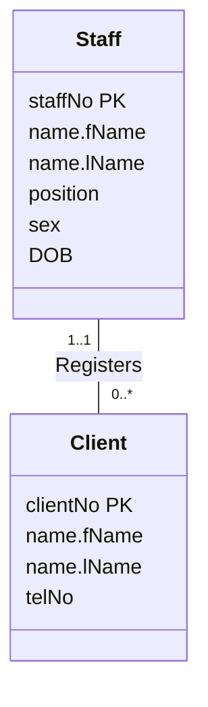

To map a **1:\* binary relationship**, make the entity on the "one" side the **parent** and the entity on the "many" side the **child**. Post a copy of the parent's primary key into the child's relation to act as a foreign key. Any attributes of the relationship also go to the child.

This is the most common case, and the [[Relational Keys|PK/FK mechanism]] in its simplest form.

## Example: Staff Registers Client

*Staff Registers Client, 1..1 to 0..\* (slide 26, an excerpt of the staff-view model on slide 20)*

Staff is on the "one" side, so it's the parent. Client is the child and gets `staffNo`.

> [!example] Result
> **Client** (clientNo, fName, lName, telNo, staffNo)
> Primary Key clientNo
> Foreign Key staffNo references Staff(staffNo)

> [!tip] Participation and nulls
> The `1..1` on the Staff side means every client *must* be registered by a staff member, so `staffNo` in Client should be NOT NULL. If it were `0..1`, the foreign key could be null.
