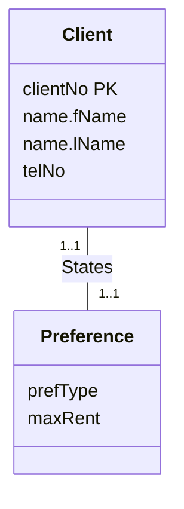

A **1:1 binary relationship** is harder to map than 1:\*, because cardinality can't tell you which entity is the parent and which is the child. Instead, **participation** (see [[Multiplicity]]) decides whether to combine the two entities into one relation, or to keep two relations and post one's primary key into the other.

| Participation | Mapping |
|---|---|
| **(a) Mandatory on both sides** | Combine both entities into one relation. Pick one original primary key as the new primary key; the other (if any) becomes an alternate key. |
| **(b) Mandatory on one side** | The entity with *optional* participation is the **parent**; the other is the **child**. Copy the parent's primary key into the child. Any relationship attributes go to the child too. |
| **(c) Optional on both sides** | Parent/child choice is arbitrary unless you know more about the data. |

## (a) Mandatory on both sides: Client States Preference

*Client States Preference, 1..1 to 1..1 (slides 28–29)*

Every client has exactly one preference and every preference belongs to exactly one client, so merge them:

> [!example] Result
> **Client** (clientNo, fName, lName, telNo, prefType, maxRent, staffNo)
> Primary Key clientNo
> Foreign Key staffNo references Staff(staffNo)

(`staffNo` is there from [[Mapping One-to-Many Relationships|Registers]].)

## (b) Mandatory on one side: Preference becomes 0..1

*Client States Preference with a 0..1 on the Preference end (slide 31)*

A client may now have zero or one preference (optional for Client), but every preference must belong to a client (mandatory for Preference). Client is the parent, and Preference is the child that receives `clientNo`:

> [!example] Result
> **Preference** (clientNo, prefType, maxRent)
> Primary Key clientNo
> Foreign Key clientNo references Client(clientNo)

This also finishes the weak entity from [[Mapping Entity Types to Relations]]: its primary key comes entirely from the owner.

> [!warning] Reading the multiplicity
> The `0..1` is drawn next to Preference, but it describes *Client's* participation: how many preferences one client can have. So the optional entity, and therefore the parent, is Client, not Preference.

## (c) Optional on both sides: Staff Uses Car

Say most cars (but not all) are used by staff, while only a minority of staff use cars. Car, although optional, is closer to always taking part in the relationship. So make **Staff the parent** and **Car the child**: Car gets a `staffNo` foreign key. The reverse would leave `carNo` null for most Staff rows.
