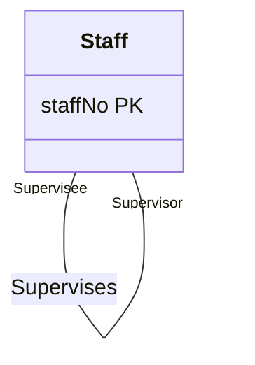

A **1:1 recursive relationship** relates an entity to itself (e.g. one staff member supervises another). It follows the same participation rules as [[Mapping One-to-One Relationships|1:1 binary relationships]], but because both ends are the same entity, the result is either **two copies of the primary key** in one relation or a separate relation holding both copies.

*Staff Supervises Staff, with roles Supervisee and Supervisor (slides 34–36). The multiplicities on each role change per case; see the table below.*

The three slides draw the same relationship and change only the multiplicities on each role:

| Case | Supervisee end | Supervisor end | Mapping |
|---|---|---|---|
| **(a) Mandatory on both sides** (slide 34) | `1..1` | `1..1` | A single relation with two copies of the primary key |
| **(b) Mandatory on only one side** (slide 35) | `0..1` | `1..1` | Either a single relation with two copies of the primary key, *or* a new relation with just two attributes, both copies of the primary key |
| **(c) Optional on both sides** (slide 36) | `0..1` | `0..1` | A new relation to represent the relationship |

> [!example] Single relation, cases (a) and (b)
> **Staff** (staffNo, fName, lName, position, sex, DOB, supervisorStaffNo)
> Primary Key staffNo
> Foreign Key supervisorStaffNo references Staff(staffNo)

> [!example] Separate relation, cases (b) and (c)
> **Supervision** (staffNo, supervisorStaffNo)
> Primary Key staffNo
> Alternate Key supervisorStaffNo
> Foreign Key staffNo references Staff(staffNo)
> Foreign Key supervisorStaffNo references Staff(staffNo)

The separate relation avoids a mostly-null `supervisorStaffNo` column when few staff take part. Because the relationship is 1:1, either column could be the primary key; the other is an alternate key.
