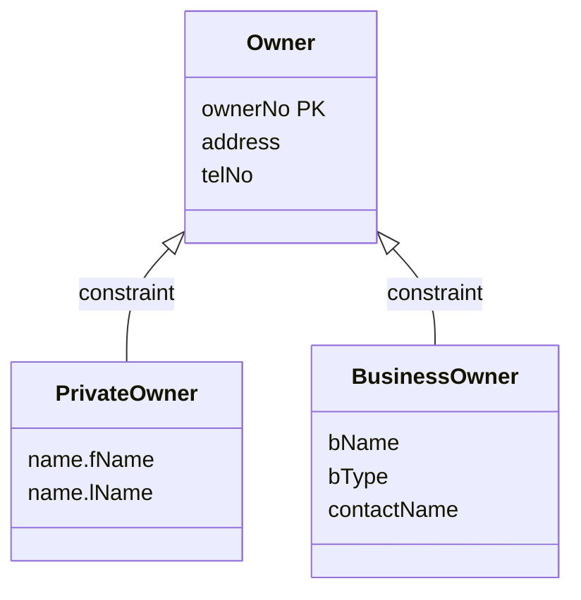

To map a **superclass/subclass relationship**, treat the [[Superclass]] as the parent entity and each [[Subclass]] as a child entity. There are several ways to turn this into one or more relations. The best one depends on:
- the [[Participation Constraint|participation]] and [[Disjoint Constraint|disjoint]] constraints,
- whether the subclasses take part in their own distinct relationships,
- how many entities take part in the superclass/subclass relationship.

## Guidelines (not hard rules)

| Participation | Disjoint | Relations required |
|---|---|---|
| **Mandatory** | Nondisjoint `{And}` | **One relation** for everything, with one or more discriminators (flags) saying what type each tuple is |
| **Optional** | Nondisjoint `{And}` | **Two relations**: one for the superclass, one for all the subclasses combined (with discriminators) |
| **Mandatory** | Disjoint `{Or}` | **Many relations**: one per combined superclass/subclass |
| **Optional** | Disjoint `{Or}` | **Many relations**: one for the superclass and one for each subclass |

The pattern: *mandatory* means every superclass tuple is also a subclass tuple, so the superclass doesn't need its own relation. *Nondisjoint* means one tuple can be several subclasses at once, so the subclasses share a relation with flags.

## Example: Owner

*Owner superclass with PrivateOwner and BusinessOwner subclasses (slides 39–42). Only the constraint label changes between slides.*

Applying each guideline to it:

> [!example] Mandatory, And (slide 39): one relation
> **AllOwner** (ownerNo, address, telNo, fName, lName, bName, bType, contactName, pOwnerFlag, bOwnerFlag)
> Primary Key ownerNo

> [!example] Optional, And (slide 40): two relations
> **Owner** (ownerNo, address, telNo)
> Primary Key ownerNo
>
> **OwnerDetails** (ownerNo, fName, lName, bName, bType, contactName, pOwnerFlag, bOwnerFlag)
> Primary Key ownerNo
> Foreign Key ownerNo references Owner(ownerNo)

> [!example] Mandatory, Or (slide 41): one relation per combined superclass/subclass
> **PrivateOwner** (ownerNo, fName, lName, address, telNo)
> Primary Key ownerNo
>
> **BusinessOwner** (ownerNo, bName, bType, contactName, address, telNo)
> Primary Key ownerNo

> [!example] Optional, Or (slide 42): superclass plus one per subclass
> **Owner** (ownerNo, address, telNo)
> Primary Key ownerNo
>
> **PrivateOwner** (ownerNo, fName, lName)
> Primary Key ownerNo
> Foreign Key ownerNo references Owner(ownerNo)
>
> **BusinessOwner** (ownerNo, bName, bType, contactName)
> Primary Key ownerNo
> Foreign Key ownerNo references Owner(ownerNo)

> [!warning] Check against the lecture
> Slides 39–42 show only the rule and the diagram, and the resulting relations were presumably worked in class. The results above apply the guideline table directly (the textbook's standard answers). The Mandatory, Or result matches the final staff-view relations on slide 50.
