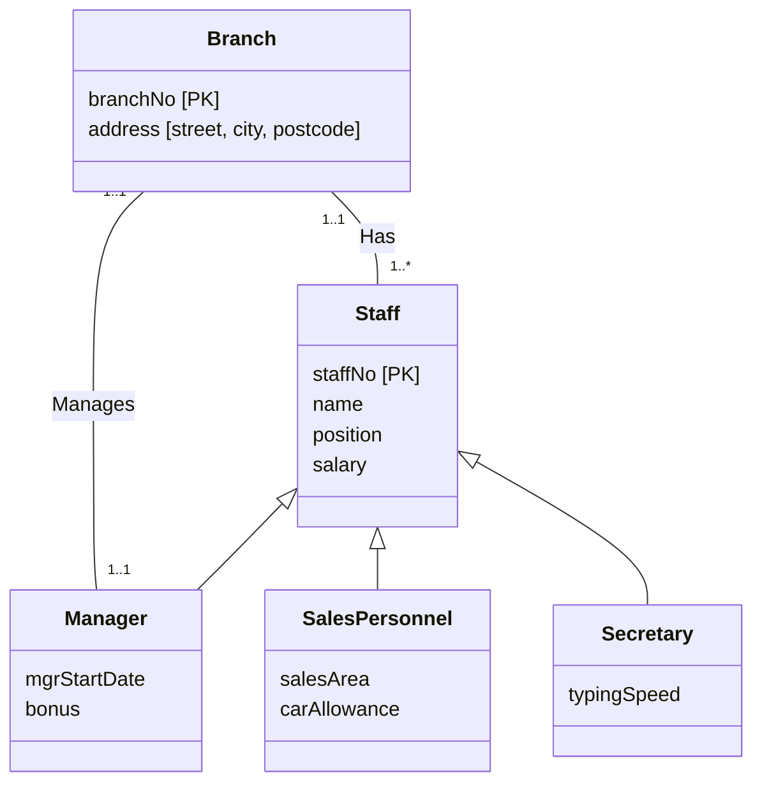

**Specialization** and **generalization** are two directions for arriving at the same [[Superclass and Subclass]] structure:
- **Specialization** (top-down) maximizes the differences between members of an entity by identifying their *distinguishing* characteristics. You start with Staff and split out Manager, SalesPersonnel, Secretary.
- **Generalization** (bottom-up) minimizes the differences between entities by identifying their *common* characteristics. You start with Manager, SalesPersonnel, Secretary and pull the shared attributes up into Staff.

In UML it's drawn as a **hollow triangle** on the superclass, with lines down to each subclass.

*Staff specialized into subclasses representing job roles (slide 11; repeated on slides 13 and 20)*

The Manages relationship attaches to **Manager**, not Staff. That's a subclass-specific relationship, which a single Staff entity couldn't express.

The same superclass can be specialized in more than one way. Slide 12 specializes Staff by **contract of employment** instead of by job role.

> [!warning] Slides 12 and 13 look incomplete in the PDF
> - **Slide 12** (contracts of employment) only shows Branch *Has* Staff and the top of the specialization triangle. The subclasses didn't come through in the export. Check the lecture recording or the original deck for what they are.
> - **Slide 13** is titled "Shared Subclass and Subclass with its own Subclass", but its diagram is identical to slide 11. For reference (general EER terms, not shown on the slide): a **shared subclass** has more than one superclass and inherits from all of them. A **subclass with its own subclass** forms a specialization *hierarchy*. Slide 19 shows one: Person → Staff → Supervisor/Manager.
