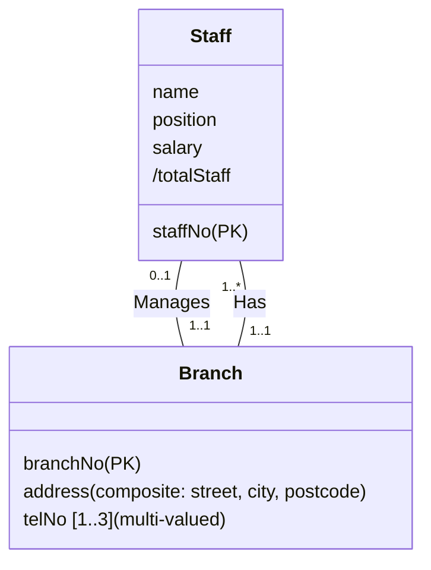

# Unit 3 — Entity-Relationship Modeling

> [!info]- Slide index — where each section comes from
> | Section of this note | Slides in the deck |
> |---|---|
> | *Intro and objectives* | 2 Objectives · 3 ER Diagram of Branch View of DreamHome *(preview)* |
> | **Notation** | 4 ER Model *(notations)* |
> | *Concepts of the ER Model* | 5 Concepts of the ER Model *(outline)* |
> | ⤷ `Entity Type` | 6 Entity Type |
> | ⤷ `Relationship Type` | 7 Relationship Types · 8 Semantic Net of Has Relationship Type · 9 Relationship Types (Degree) · 10 Binary Relationship · 11 Ternary Relationship called Registers · 12 Quaternary Relationship called Arranges · 13 Relationship Types (Recursive) · 14 Recursive Relationship called Supervises with Role Names · 15 Entities associated through two distinct Relationships with Role Names |
> | ⤷ `Attribute` | 16 Attributes · 17 Attributes (Simple, Composite) · 18 Attributes (Single/Multi-valued) · 19 Attributes (Derived) |
> | ⤷ `Keys` | 20 Keys |
> | *Worked example: Staff and Branch* | 21 ER Diagram of Staff and Branch Entities and their Attributes |
> | ⤷ `Strong and Weak Entity Types` | 22 Entity Type (Strong/Weak) · 23 Strong Entity Type called Client and Weak Entity Type called Preference |
> | ⤷ `Multiplicity` | 24 Structural Constraints · 25 Structural Constraints (binary types) · 26 Semantic Net of Staff Manages Branch (1:1) · 27 Multiplicity - (1:1) Relationship Type · 28 Semantic Net of Staff Oversees PropertyForRent (1:*) · 29 Multiplicity - (1:*) Relationship Type · 30 Semantic Net of Newspaper Advertises PropertyForRent (*:*) · 31 Multiplicity - (*:*) Relationship Type · 32 Structural Constraints (complex relationships) · 33 Semantic Net of Ternary Registers Relationship with Values Fixed · 34 Multiplicity of Ternary Registers Relationship · 35 Summary of Multiplicity Constraints · 36 Structural Constraints (Cardinality and Participation) · 37 Multiplicity as Cardinality and Participation Constraints · 38 Multiplicity as Cardinality and Participation Constraints |
> | ⤷ `Fan Trap` | 39 Problems with ER Models *(intro)* · 40 Problems with ER Models (Fan Trap) · 41 An Example of a Fan Trap · 42 Semantic Net of ER Model with Fan Trap · 43 Restructuring ER Model to Remove Fan Trap · 44 Semantic Net of Restructured ER Model with Fan Trap Removed |
> | ⤷ `Chasm Trap` | 40 Problems with ER Models (Chasm Trap) · 45 An Example of a Chasm Trap · 46 Semantic Net of ER Model with Chasm Trap · 47 ER Model Restructured to Remove Chasm Trap · 48 Semantic Net of Restructured ER Model with Chasm Trap Removed |
> | *Closing* | 49 ER Diagram of Branch View of DreamHome *(complete)* |

An ER diagram (Entity-Relationship Diagram) is a graphical representation of a database's logical structure — entities, their attributes, and how entities relate. Several notations exist (Chen, Crow's Foot, UML), but this course uses the **UML database notation** throughout, including on exams. The whole unit is built around one running example: the *DreamHome* property-rental database (Staff, Branch, Client, PropertyForRent, Owners, and so on) — see slide 3/49 for the branch view.

> [!note]- Mermaid — ER Diagram of Branch View of DreamHome (slides 3 & 49)
> Reconstructed from the slide's UML-notation diagram. `ManagesRel`, `RegistersRel`, and `AdvertisesRel` stand in for the diamond/attribute-box relationships that carry their own attributes (mirroring the dotted-line attribute boxes in the original). Multiplicities on the dense full diagram were read off small print — double-check against the slide image if you need exact numbers for an exam answer.
> ```mermaid
> classDiagram
>     class Staff {
>         staffNo (PK)
>         name
>         position
>         salary
>         /totalStaff
>     }
>     class Branch {
>         branchNo (PK)
>         address (street, city, postcode)
>         telNo [1..3]
>     }
>     class Client {
>         clientNo (PK)
>         name (fName, lName)
>         telNo
>     }
>     class Preference {
>         prefType
>         maxRent
>     }
>     class Lease {
>         leaseNo (PK)
>     }
>     class PropertyForRent {
>         propertyNo (PK)
>     }
>     class Newspaper {
>         newspaperName (PK)
>     }
>     class PrivateOwner {
>         ownerNo (PK)
>     }
>     class BusinessOwner {
>         bName (PK)
>     }
>     class ManagesRel {
>         mgrStartDate
>         bonus
>     }
>     class RegistersRel {
>         dateJoined
>     }
>     class AdvertisesRel {
>         dateAdvert
>         cost
>     }
>
>     Staff "0..10" -- "0..1" Staff : Supervises
>     Staff "0..1" -- "1..1" ManagesRel
>     ManagesRel "1..1" -- "1..1" Branch
>     Branch "1..1" -- "1..*" Staff : Has
>     Staff "0..1" -- "0..100" PropertyForRent : Oversees
>     Staff "1..*" -- "1..1" RegistersRel
>     Branch "1..1" -- "1..1" RegistersRel
>     RegistersRel "1..1" -- "0..*" Client
>     Client "1..1" -- "0..*" Lease : Holds
>     Lease "1..1" -- "0..*" PropertyForRent : LeasedBy
>     Client "1..1" -- "1..1" Preference : States
>     Branch "1..1" -- "1..*" PropertyForRent : Offers
>     Newspaper "0..*" -- "1..*" AdvertisesRel
>     AdvertisesRel "1..1" -- "1..*" PropertyForRent
>     PrivateOwner "0..1" -- "1..*" PropertyForRent : POwns
>     BusinessOwner "0..1" -- "1..*" PropertyForRent : BOwns
> ```

## Concepts of the ER Model

The model is built from three ingredients: entity types, relationship types, and attributes.

## Entity Types

![[Entity Type]]

## Relationship Types

![[Relationship Type]]

## Attributes

![[Attribute]]

## Keys

![[Keys]]

A worked example (Staff and Branch entities) shows all four attribute kinds and both key concepts side by side on one diagram: `staffNo` and `branchNo` are primary keys; `address` (street/city/postcode) is a composite attribute; `/totalStaff` is a derived attribute; `telNo [1..3]` is multi-valued.



## Strong and Weak Entity Types

![[Strong and Weak Entity Types]]

## Multiplicity

![[Multiplicity]]

## Connection Traps

Problems that arise when designing a conceptual data model are called **connection traps** — usually caused by misinterpreting the meaning of a relationship. The two main kinds are the fan trap and the chasm trap.

![[Fan Trap]]

![[Chasm Trap]]
