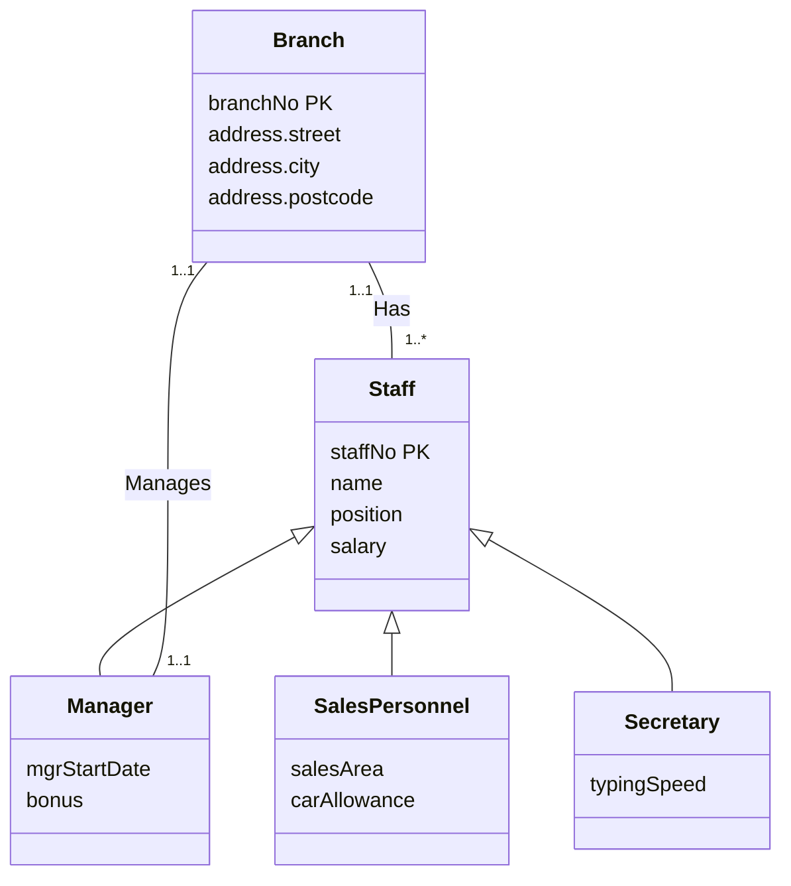
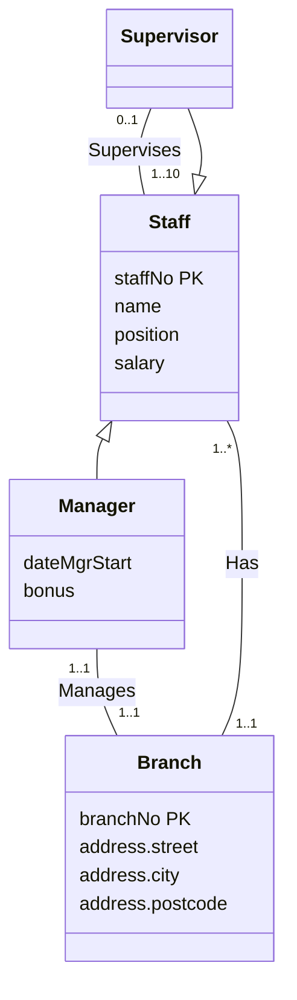
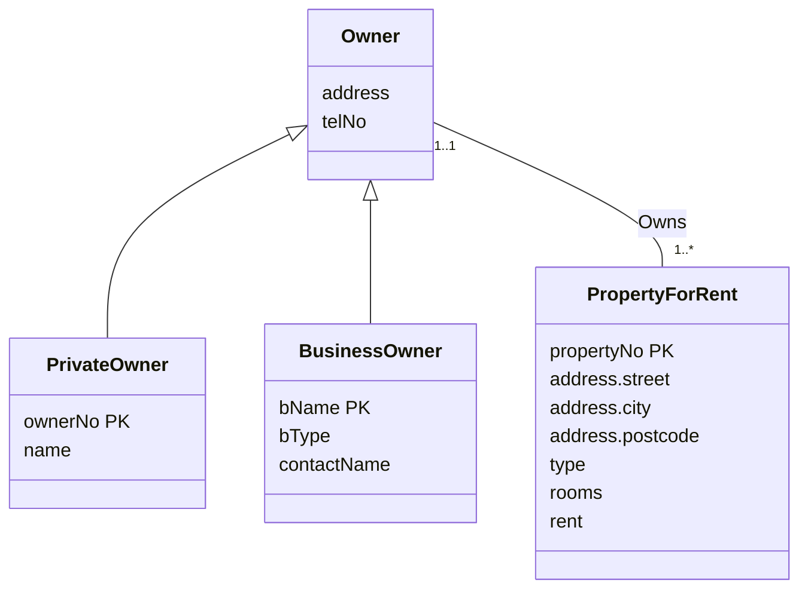
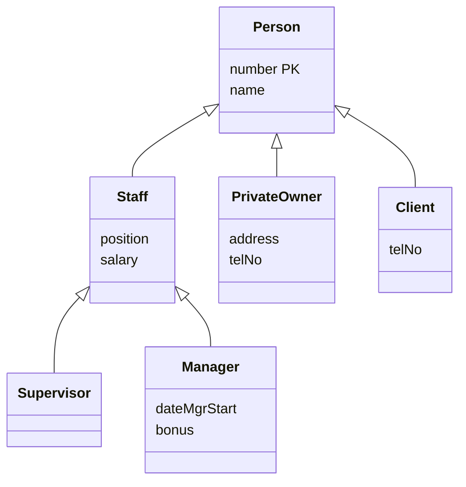
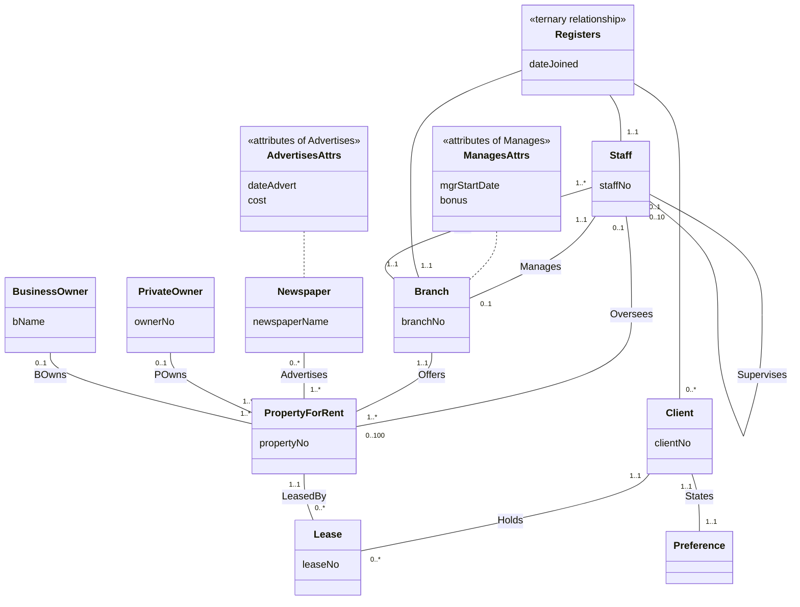
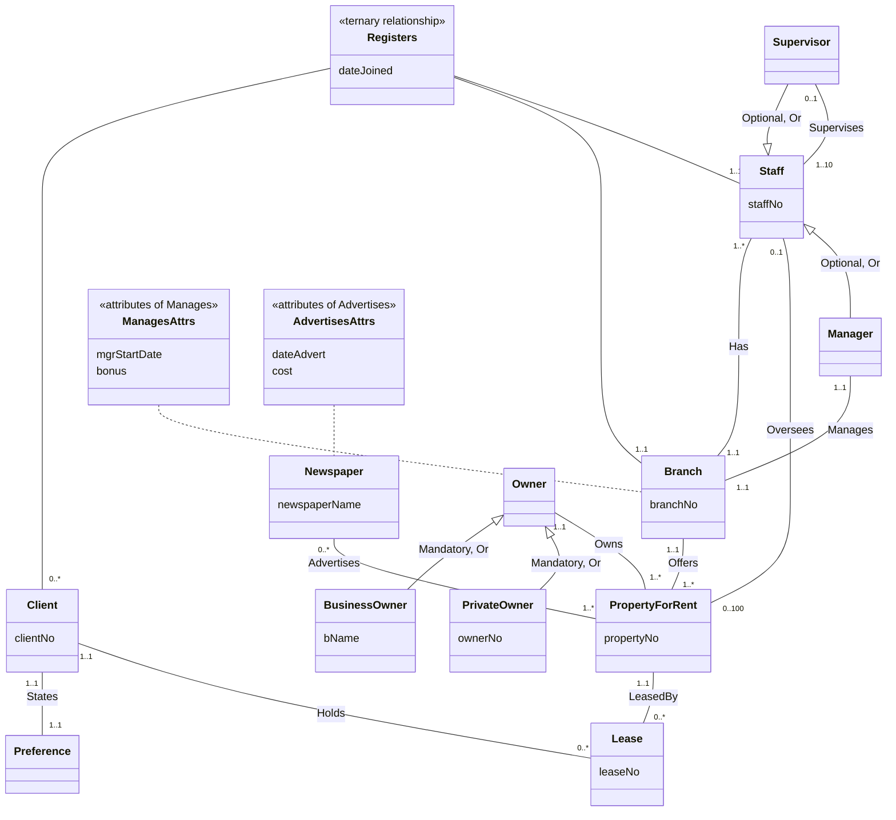
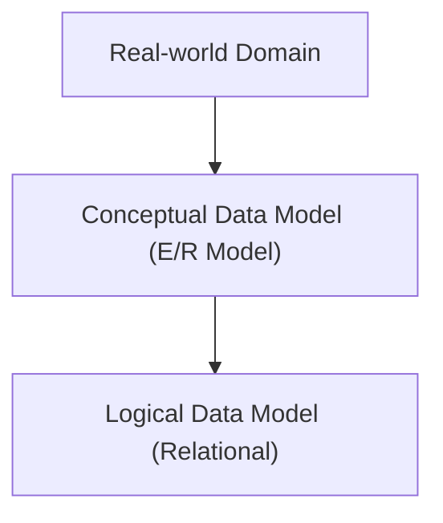

# Unit 4 — Enhanced Entity-Relationship Modeling

> [!info]- Slide index — where each section comes from
> | Section of this note | Slides in the deck |
> |---|---|
> | *Objectives* | 2 Objectives |
> | **Why EER** | |
> | ⤷ `Enhanced Entity-Relationship Model` | 3 Enhanced Entity-Relationship Model · 4 Enhanced Entity-Relationship Model |
> | **Specialization / Generalization** | |
> | ⤷ `Superclass` | 5 Specialization / Generalization · 6 Specialization / Generalization |
> | ⤷ `Subclass` | 5 Specialization / Generalization · 6 Specialization / Generalization |
> | ⤷ Why not one entity, or only subclasses? | 7 AllStaff Relation Holding Details of all Staff · 8 Specialization / Generalization |
> | ⤷ `Attribute Inheritance` | 9 Specialization / Generalization |
> | ⤷ `Specialization` | 10 Specialization / Generalization |
> | ⤷ `Generalization` | 10 Specialization / Generalization |
> | ⤷ Example: Staff by job role | 11 Specialization/Generalization of Staff Entity into Subclasses Representing Job Roles 📊 · 12 …into Contracts of Employment · 13 EER Diagram with Shared Subclass and Subclass with its own Subclass · 20 DreamHome Example - Staff Superclass with Manager, SalesPersonnel, and Secretary Subclasses |
> | **Constraints on Specialization / Generalization** | |
> | ⤷ `Participation Constraint` | 14 Constraints on Specialization / Generalization |
> | ⤷ `Disjoint Constraint` | 15 Constraints on Specialization / Generalization |
> | ⤷ The four categories | 16 Constraints on Specialization / Generalization |
> | **DreamHome Examples** | 17 Staff Superclass with Supervisor and Manager Subclasses 📊 · 18 Owner Superclass with PrivateOwner and BusinessOwner Subclasses 📊 · 19 Person Superclass with Staff, PrivateOwner, and Client Subclasses 📊 |
> | **Branch View: ER → EER** | 21 ER Diagram of Branch View of DreamHome 📊 · 22 EER Diagram of Branch View of DreamHome with Specialization/Generalization 📊 |
> | **Aggregation & Composition** | |
> | ⤷ `Aggregation` | 23 Aggregation · 24 Examples of Aggregation 📊 · 27 Composition & Aggregation |
> | ⤷ `Composition` | 25 Composition · 26 Example of Composition – Advert and Newspaper 📊 · 27 Composition & Aggregation |
> | **EER in the Design Process** | 28 E/R Model in Database Design Process 📊 |

## Objectives
- Why basic ER concepts fall short for complex applications
- The main EER concepts: specialization/generalization, aggregation, composition
- How to draw them in an EER diagram using UML

## Why EER

![[Enhanced Entity-Relationship Model]]

## Specialization / Generalization

![[Superclass]]

![[Subclass]]

### Why not one entity, or only subclasses?

*The `AllStaff` relation — one table holding every kind of staff (slide 7)*

| staffNo | name | position | salary | mgrStartDate | bonus | salesArea | carAllowance | typingSpeed |
|---|---|---|---|---|---|---|---|---|
| SL21 | John White | Manager | 30000 | 01/02/95 | 2000 | | | |
| SG37 | Ann Beech | Assistant | 12000 | | | | | |
| SG66 | Mary Martinez | Sales Manager | 27000 | | | SA1A | 5000 | |
| SA9 | Mary Howe | Assistant | 9000 | | | | | |
| SL89 | Stuart Stern | Secretary | 8500 | | | | | 100 |
| SL31 | Robert Chin | Snr Sales Asst | 17000 | | | SA2B | 3700 | |
| SG5 | Susan Brand | Manager | 24000 | 01/06/91 | 2350 | | | |

Column groups: `staffNo…salary` apply to **all staff** · `mgrStartDate, bonus` to **branch managers** · `salesArea, carAllowance` to **sales personnel** · `typingSpeed` to **secretarial staff**.

| Approach | Problems |
|---|---|
| **Single entity only** | Lots of nulls in subclass-specific attributes (hard to work with) · can't represent relationships that only apply to one subclass |
| **Subclasses only** | Similar concepts described more than once · keeping the shared attributes consistent across subclasses |

A superclass *plus* subclasses avoids both.

![[Attribute Inheritance]]

![[Specialization]]

![[Generalization]]

### Example: Staff by job role

*Staff specialized into Manager, SalesPersonnel, and Secretary (slides 11 and 20)*

> [!warning] Check against the slides
> - On slides 11 and 20 there's a faint, cut-off label on the line under the triangle — probably the `{Participation, Disjoint}` constraint — but it isn't legible in the PDF, so it's left out here.
> - **Slide 12** ("…into Contracts of Employment") only shows `Branch` –Has– `Staff` and the top of a specialization triangle; the subclasses themselves are missing from the PDF (likely an animation that didn't export).
> - **Slide 13** ("Shared Subclass and Subclass with its own Subclass") shows the same picture as slide 11, so the shared-subclass example isn't actually in the PDF.

## Constraints on Specialization / Generalization

![[Participation Constraint]]

![[Disjoint Constraint]]

### The four categories

| | **Disjoint (Or)** | **Nondisjoint (And)** |
|---|---|---|
| **Mandatory** | `{Mandatory, Or}` — e.g. every `Owner` is a `PrivateOwner` *or* a `BusinessOwner` | `{Mandatory, And}` |
| **Optional** | `{Optional, Or}` — e.g. a `Staff` member may be a `Supervisor` or a `Manager`, or neither | `{Optional, And}` |

## DreamHome Examples

*Staff superclass with Supervisor and Manager subclasses (slide 17)*

- `Supervisor` has no attributes of its own — it exists as a subclass so that *it* (not every staff member) takes part in **Supervises**.

*Owner superclass with PrivateOwner and BusinessOwner subclasses (slide 18)*

- The two subclasses have **different primary keys** (`ownerNo` vs `bName`); the superclass `Owner` holds only the shared `address` and `telNo`.

*Person superclass with Staff, PrivateOwner, and Client subclasses — Staff has its own subclasses (slide 19)*

- A multi-level hierarchy: `Manager` inherits from `Staff`, which inherits from `Person`.

## Branch View: ER → EER

*Original ER diagram of the DreamHome branch view (slide 21)*

*The same view as an EER diagram, with specialization/generalization (slide 22)*

> [!note] What changed between the two (the circled regions)
> - **Staff:** the recursive *Supervises* and the *Manages* relationship now attach to new `Supervisor` and `Manager` subclasses of `Staff` — `{Optional, Or}` — instead of to every staff member. Multiplicities tighten from `0..1`/`0..10` and `1..1`/`0..1` to `0..1`/`1..10` and `1..1`/`1..1`.
> - **Owners:** the two separate *POwns* / *BOwns* relationships (each `0..1` on the owner side) become a single *Owns* (`1..1`) to a new `Owner` superclass — `{Mandatory, Or}` — over `PrivateOwner` and `BusinessOwner`.

> [!warning] Diagram drawing limits
> - Mermaid can't attach a box to a line, so the association-attribute boxes (`mgrStartDate, bonus` on *Manages*; `dateAdvert, cost` on *Advertises*) and the *Registers* diamond are drawn as separate stereotyped classes joined with lines.
> - On slide 22 the circle overlaps the `Registers` multiplicities on the `Staff` and `Branch` side; `1..1` is assumed from slide 21.

## Aggregation & Composition

![[Aggregation]]

![[Composition]]

## EER in the Design Process

*Where the (E)ER model sits in database design (slide 28)*

## Notes to Self
- Check the lecture recording or textbook for the missing slide 12 (contracts of employment) and slide 13 (shared subclass) diagrams.
