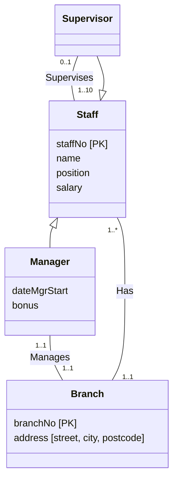
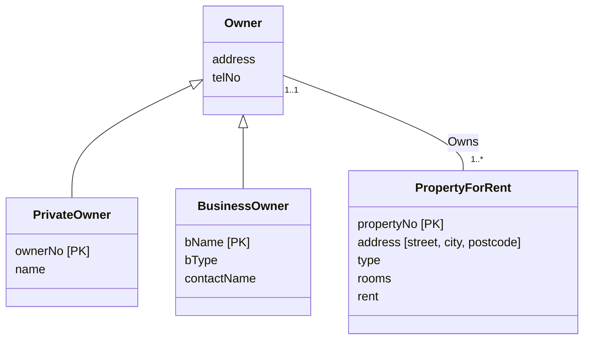
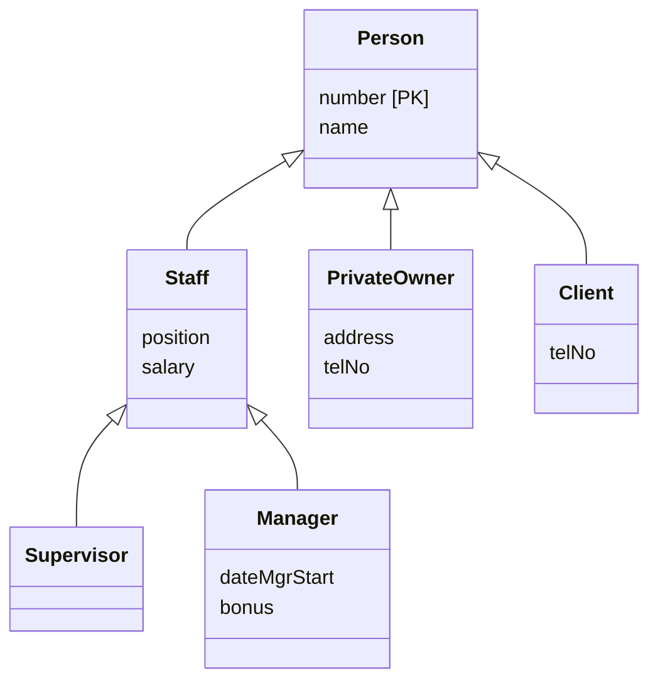
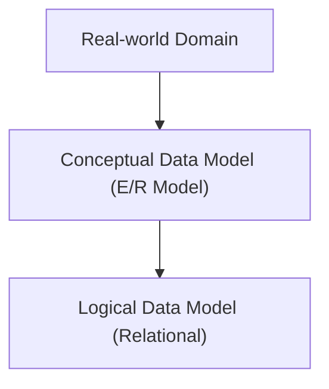

# Unit 4 — Enhanced Entity-Relationship Modeling

> [!info]- Slide index — where each section comes from
> | Section of this note | Slides in the deck |
> |---|---|
> | *Intro and objectives* | 2 Objectives |
> | ⤷ `Enhanced Entity-Relationship Model` | 3 Enhanced Entity-Relationship Model · 4 Enhanced Entity-Relationship Model |
> | **Specialization / Generalization** | |
> | ⤷ `Superclass and Subclass` | 5 Specialization / Generalization *(superclass, subclass)* · 6 Specialization / Generalization *(1:1, membership rules)* · 7 AllStaff Relation Holding Details of all Staff · 8 Specialization / Generalization *(single entity vs. subclasses only)* |
> | ⤷ `Attribute Inheritance` | 9 Specialization / Generalization *(attribute inheritance)* |
> | ⤷ `Specialization and Generalization` | 10 Specialization / Generalization *(definitions)* · 11 Specialization/Generalization of Staff Entity into Subclasses Representing Job Roles 📊 · 12 Specialization/Generalization of Staff Entity into Contracts of Employment *(incomplete in PDF)* · 13 EER Diagram with Shared Subclass and Subclass with its own Subclass *(same diagram as 11)* |
> | ⤷ `Constraints on Specialization and Generalization` | 14 Constraints on Specialization / Generalization *(participation)* · 15 Constraints on Specialization / Generalization *(disjoint)* · 16 Constraints on Specialization / Generalization *(four categories)* |
> | ⤷ *DreamHome examples* | 17 DreamHome Example - Staff Superclass with Supervisor and Manager Subclasses 📊 · 18 DreamHome Example - Owner Superclass with PrivateOwner and BusinessOwner Subclasses 📊 · 19 DreamHome Example - Person Superclass with Staff, PrivateOwner, and Client Subclasses 📊 · 20 DreamHome Example - Staff Superclass with manager, SalesPersonel, and Secretary Subclasses *(repeat of 11)* · 21 ER Diagram of Branch View of DreamHome *(see Unit 3)* · 22 EER Diagram of Branch View of DreamHome with Specialization/Generalization 📊 |
> | **Aggregation and Composition** | |
> | ⤷ `Aggregation` | 23 Aggregation · 24 Examples of Aggregation 📊 |
> | ⤷ `Composition` | 25 Composition · 26 Example of Composition – Advert and Newspaper 📊 · 27 Composition & Aggregation |
> | *Closing* | 28 E/R Model in Database Design Process 📊 |

This unit extends [[03 - Entity-Relationship Modeling|Unit 3]]'s ER model with specialization/generalization, aggregation, and composition. It uses the same running *DreamHome* example and the same UML notation.

## The EER Model

![[Enhanced Entity-Relationship Model]]

## Specialization / Generalization

![[Superclass and Subclass]]

![[Attribute Inheritance]]

![[Specialization and Generalization]]

![[Constraints on Specialization and Generalization]]

## DreamHome Examples

*Staff superclass with Supervisor and Manager subclasses (slide 17)*



This replaces Unit 3's recursive *Supervises* on Staff and the *Manages* between Staff and Branch. Both relationships now attach to the subclass that actually takes part in them.

*Owner superclass with PrivateOwner and BusinessOwner subclasses (slide 18)*



This is generalization: Unit 3's separate *POwns* and *BOwns* relationships collapse into one *Owns* on the Owner superclass. The primary keys stay on the subclasses because the two kinds of owner are identified differently.

*Person superclass with Staff, PrivateOwner, and Client subclasses. Staff has its own subclasses (slide 19)*



This is a specialization **hierarchy**: Supervisor and Manager inherit from Staff, which inherits from Person.

> [!note]- Mermaid — EER Diagram of Branch View of DreamHome with Specialization/Generalization (slide 22)
> Same as the Unit 3 branch view, except for the two circled regions: Staff → {Optional, Or} Supervisor/Manager, and Owner → {Mandatory, Or} PrivateOwner/BusinessOwner. `ManagesRel`, `RegistersRel`, and `AdvertisesRel` stand in for the relationships that carry their own attributes (the dotted-line attribute boxes on the slide). Multiplicities were read off small print, so double-check against the slide if you need exact numbers.
> ```mermaid
> classDiagram
>     class Supervisor
>     class Manager
>     class Staff {
>         staffNo
>     }
>     class Branch {
>         branchNo
>     }
>     class Client {
>         clientNo
>     }
>     class Preference
>     class Lease {
>         leaseNo
>     }
>     class PropertyForRent {
>         propertyNo
>     }
>     class Newspaper {
>         newspaperName
>     }
>     class Owner
>     class PrivateOwner {
>         ownerNo
>     }
>     class BusinessOwner {
>         bName
>     }
>     class ManagesRel {
>         mgrStartDate
>         bonus
>     }
>     class RegistersRel {
>         dateJoined
>     }
>     class AdvertisesRel {
>         dateAdvert
>         cost
>     }
>
>     Staff <|-- Supervisor : Optional, Or
>     Staff <|-- Manager : Optional, Or
>     Owner <|-- PrivateOwner : Mandatory, Or
>     Owner <|-- BusinessOwner : Mandatory, Or
>
>     Supervisor "0..1" -- "1..10" Staff : Supervises
>     Manager "1..1" -- ManagesRel
>     ManagesRel -- "1..1" Branch : Manages
>     Staff "1..*" -- "1..1" Branch : Has
>     Staff "0..1" -- "0..100" PropertyForRent : Oversees
>     Staff "1..1" -- RegistersRel
>     Branch "1..1" -- RegistersRel
>     RegistersRel -- "0..*" Client : Registers
>     Client "1..1" -- "0..*" Lease : Holds
>     Lease "0..*" -- "1..1" PropertyForRent : LeasedBy
>     Client "1..1" -- "1..1" Preference : States
>     Branch "1..1" -- "1..*" PropertyForRent : Offers
>     Newspaper "0..*" -- AdvertisesRel
>     AdvertisesRel -- "1..*" PropertyForRent : Advertises
>     Owner "1..1" -- "1..*" PropertyForRent : Owns
> ```

## Aggregation and Composition

![[Aggregation]]

![[Composition]]

## Where This Fits in Database Design

*E/R model in the database design process (slide 28)*



The (E)ER diagram is the **conceptual** model. The next step is mapping it to relational tables.
