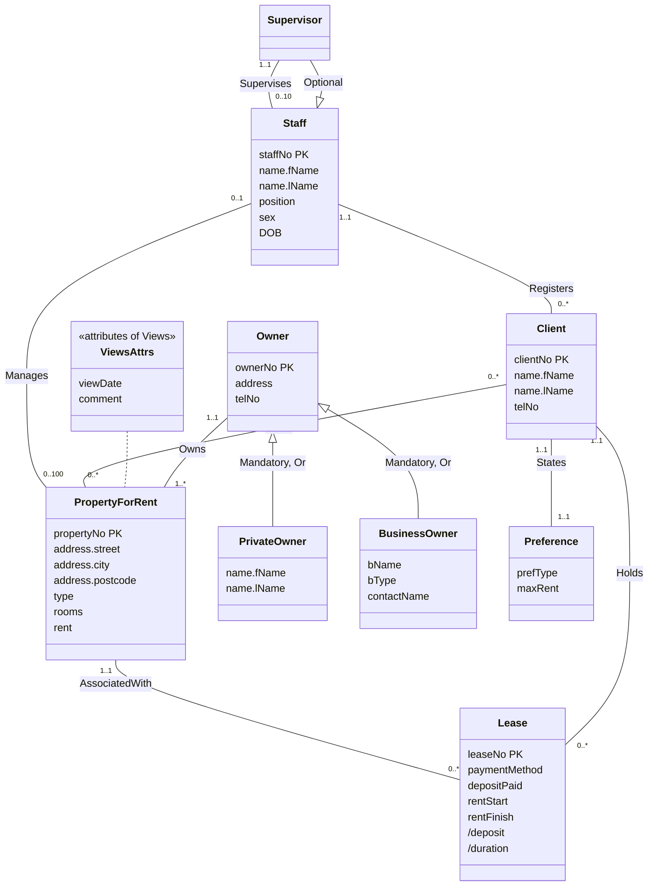

# Unit 5 — Logical Database Design

> [!info]- Slide index — where each section comes from
> | Section of this note | Slides in the deck |
> |---|---|
> | **From Conceptual to Logical** | 4 Database Design *(EER branch view, see Unit 4)* |
> | ⤷ `Logical Database Design` | 2 Logical Database Design for the Relational Data Model · 3 E/R Model in the Database Design Process 📊 · 5 Database Design |
> | **Relational Model Basics** | |
> | ⤷ `Relational Model Terminology` | 6 Relational Model Terminology · 7 Relational Model Terminology · 8 Instances of Branch and Staff (part) Relations · 9 Examples of Attribute Domains |
> | ⤷ `Relation Schema` | 10 Database Relations · 17 Representing Logical Model |
> | ⤷ `Properties of Relations` | 11 Properties of Relations · 12 Properties of Relations |
> | ⤷ `Relational Keys` | 13 Relational Keys · 24 Derive Relations for Logical Data Model *(PK/FK mechanism, parent/child)* |
> | ⤷ `Relational Integrity` | 14 Integrity Constraints · 15 Relational Integrity · 16 Relational Integrity |
> | **Deriving Relations** | 18 Build and Validate Logical Data Model · 19 Build and Validate Logical Data Model · 21 Derive Relations for Logical Data Model *(the nine steps)* |
> | ⤷ Staff view conceptual model | 20 Conceptual Data Model for Staff View Showing all Attributes 📊 |
> | ⤷ `Mapping Entity Types to Relations` | 22 (1) Strong entity types 📊 · 23 (2) Weak entity types 📊 |
> | ⤷ `Mapping One-to-Many Relationships` | 25 (3) 1:* binary relationship types · 26 Registers example 📊 |
> | ⤷ `Mapping One-to-One Relationships` | 27 (4) 1:1 binary relationship types · 28 (4) the three cases 📊 · 29 (a) Mandatory on both sides 📊 · 30 (b) Mandatory on one side · 31 (b) Example 📊 · 32 (c) Optional on both sides |
> | ⤷ `Mapping Recursive One-to-One Relationships` | 33 (5) 1:1 recursive relationships · 34 (a) 📊 · 35 (b) 📊 · 36 (c) 📊 |
> | ⤷ `Mapping Superclass-Subclass Relationships` | 37 (6) Superclass/subclass relationship types · 38 Guidelines for Representation of Superclass/Subclass Relationship · 39 Mandatory Nondisjoint 📊 · 40 Optional Nondisjoint 📊 · 41 Mandatory Disjoint 📊 · 42 Optional Disjoint 📊 |
> | ⤷ `Mapping Many-to-Many Relationships` | 43 (7) *:* binary relationship types · 44 Example 📊 |
> | ⤷ `Mapping Complex Relationships` | 45 (8) Complex relationship types · 46 Example 📊 |
> | ⤷ `Mapping Multi-Valued Attributes` | 47 (9) Multi-valued attributes · 48 Example 📊 |
> | ⤷ Summary | 49 Summary of How to Map Entities and Relationships to Relations |
> | ⤷ Relations for the staff view | 50 Relations for the Staff View of DreamHome |
> | **Next Step** | 51 Build and Validate Logical Data Model *(normalization)* |
>
> Omitted: 1 title slide, 52 comics.

This unit takes the conceptual (E)ER model from [[04 - Enhanced Entity-Relationship Modeling|Unit 4]] and turns it into relations. Slide 4 reuses Unit 4's EER diagram of the DreamHome branch view, which is already drawn there under *DreamHome Examples*.

## From Conceptual to Logical

![[Logical Database Design]]

## Relational Model Basics

![[Relational Model Terminology]]

![[Relation Schema]]

![[Properties of Relations]]

![[Relational Keys]]

![[Relational Integrity]]

## Deriving Relations

Goal: create relations that represent every entity, relationship, and attribute identified in the conceptual model. The running example is the **staff view** of DreamHome.

*Conceptual data model for the staff view, showing all attributes (slide 20)*

`/deposit` and `/duration` are **derived** attributes (the `/` prefix), computed rather than stored.

> [!warning] Check against the slide
> The constraint label on the Staff → Supervisor triangle is cut off on the slide (it reads `{Optiona }`), so only "Optional" is shown here; the disjoint part isn't visible. The *Views* attribute box is drawn as a separate stereotyped class, since Mermaid can't attach a box to a line.

The relations are derived in this order:

| # | Step | Covers |
|---|---|---|
| 1 | Strong entity types | Entity types |
| 2 | Weak entity types | Entity types |
| 3 | 1:\* binary relationship types | Relationship types |
| 4 | 1:1 binary relationship types | Relationship types |
| 5 | 1:1 recursive relationship types | Relationship types |
| 6 | Superclass/subclass relationship types | Relationship types |
| 7 | \*:\* binary relationship types | Relationship types |
| 8 | Complex relationship types | Relationship types |
| 9 | Multi-valued attributes | Attributes |

![[Mapping Entity Types to Relations]]

![[Mapping One-to-Many Relationships]]

![[Mapping One-to-One Relationships]]

![[Mapping Recursive One-to-One Relationships]]

![[Mapping Superclass-Subclass Relationships]]

![[Mapping Many-to-Many Relationships]]

![[Mapping Complex Relationships]]

![[Mapping Multi-Valued Attributes]]

### Summary of the mapping rules

*Slide 49*

| Entity / relationship | Mapping |
|---|---|
| Strong entity | Relation with all simple attributes |
| Weak entity | Relation with all simple attributes; primary key identified once the relationship with each owner is mapped |
| 1:\* binary | Post the "one" side's PK into the "many" side as a FK; relationship attributes go to the "many" side too |
| 1:1, mandatory both sides | Combine into one relation |
| 1:1, mandatory one side | Post the PK of the "optional" side into the "mandatory" side as a FK |
| 1:1, optional both sides | Arbitrary without further information |
| Superclass/subclass | See the guideline table in [[Mapping Superclass-Subclass Relationships]] |
| \*:\* binary, complex | New relation with the relationship's attributes, plus a copy of each owner entity's PK as FKs |
| Multi-valued attribute | New relation for the attribute, plus a copy of the owner entity's PK as a FK |

### Relations for the staff view of DreamHome

*The finished logical model (slide 50)*

| Relation | Keys |
|---|---|
| **Staff** (staffNo, fName, lName, position, sex, DOB, supervisorStaffNo) | PK staffNo FK supervisorStaffNo references Staff(staffNo) |
| **PrivateOwner** (ownerNo, fName, lName, address, telNo) | PK ownerNo |
| **BusinessOwner** (ownerNo, bName, bType, contactName, address, telNo) | PK ownerNo AK bName AK telNo |
| **Client** (clientNo, fName, lName, telNo, prefType, maxRent, staffNo) | PK clientNo FK staffNo references Staff(staffNo) |
| **PropertyForRent** (propertyNo, street, city, postcode, type, rooms, rent, ownerNo, staffNo) | PK propertyNo FK ownerNo references PrivateOwner(ownerNo) and BusinessOwner(ownerNo) FK staffNo references Staff(staffNo) |
| **Viewing** (clientNo, propertyNo, dateView, comment) | PK clientNo, propertyNo FK clientNo references Client(clientNo) FK propertyNo references PropertyForRent(propertyNo) |
| **Lease** (leaseNo, paymentMethod, depositPaid, rentStart, rentFinish, clientNo, propertyNo) | PK leaseNo AK propertyNo, rentStart AK clientNo, rentStart FK clientNo references Client(clientNo) FK propertyNo references PropertyForRent(propertyNo) Derived deposit (PropertyForRent.rent × 2) Derived duration (rentFinish − rentStart) |

How each one came about:
- **Staff**: the optional Supervisor subclass and the *Supervises* relationship collapse into a recursive `supervisorStaffNo` foreign key.
- **PrivateOwner / BusinessOwner**: `{Mandatory, Or}`, so one relation per combined superclass/subclass.
- **Client**: *States* Preference was mandatory on both sides, so Preference merged into Client; *Registers* added `staffNo`.
- **PropertyForRent**: gets `ownerNo` from *Owns* and `staffNo` from *Manages* (both 1:\*).
- **Viewing**: the \*:\* *Views* relationship.
- **Lease**: gets `clientNo` from *Holds* and `propertyNo` from *AssociatedWith*.

> [!note] Derived attributes (circled on slide 50)
> `deposit` and `duration` aren't stored as columns. The relation records *how* to compute them, from the property's rent and from the lease dates.

> [!warning] Things to watch in the final relations
> - `ownerNo` in PropertyForRent references **two** relations, a side effect of the `{Mandatory, Or}` mapping. In SQL a single foreign key can only reference one table, so this needs another mechanism (e.g. a check or trigger) at the physical design stage.
> - The diagram names the Views attribute `viewDate`, but the relation uses `dateView`.

## Next Step

Validate the relations in the logical model using **normalization**.

## Notes to Self
- The worked-example slides (26, 31, 39–42, 44, 46, 48) only show the diagrams. The results in the Content notes apply each rule directly, so check them against the lecture recording, especially Registration and Telephone.
