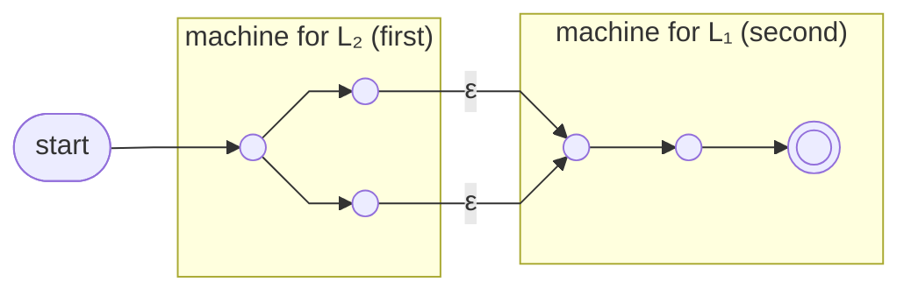

The [[Regular Language|regular languages]] are closed under **concatenation**: L₁L₂ = {st : s ∈ L₁, t ∈ L₂} — a string of the first language followed by a string of the second.

**Construction** (for L₄ = L₂L₁, so L₂'s machine comes first):
1. Demote every accepting state of the *first* machine (L₂) to an ordinary state
2. Add an ε-transition from each former accepting state of L₂ to the start state of the *second* machine (L₁), and demote that start state to an ordinary state

Result: the new start is L₂'s start (reading begins with the L₂ part), and **only L₁'s accepting states** remain accepting (the string must finish inside L₁'s machine).

*L₄ = L₂L₁ — L₂'s former accepting states ε-bridge into L₁'s former start (slide 26)*

The ε-bridges are where the machine *guesses* the L₂ part has ended. Non-determinism does the splitting for us — no symbol is consumed at the boundary.

> [!question] A deliberate demotion
> Suppose the construction had left L₂'s former accepting states accepting. Which strings would the machine wrongly accept?
>
> Answer — **every string of L₂ on its own**, with no L₁ part. A computation could stop in a former L₂ accepting state and report success without ever entering L₁'s machine. But L₂L₁ requires both parts, so unless ε ∈ L₁ a bare L₂ string doesn't belong. Passing through "L₂ finished" is *progress, not victory*.
