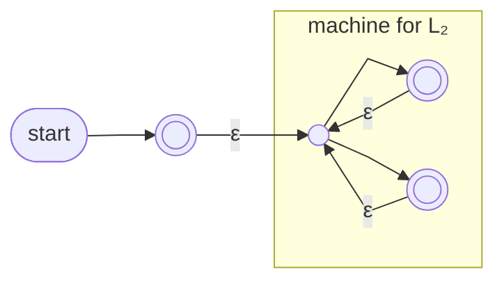

The [[Regular Language|regular languages]] are closed under the **[[Kleene Star]]** of a language: L* = {s₁s₂⋯sₖ : k ≥ 0, sᵢ ∈ L} — zero or more strings of L concatenated.

**Construction** (for L₅ = L₂*):
1. Add a **new start state that also accepts**, with an ε-transition into L₂'s former start — handles k = 0, since ε ∈ L* by definition whatever L is
2. Add an ε-transition from every accepting state of L₂ **back to L₂'s former start** — handles repetition: finish one block, silently return, begin the next
3. The old accepting states **stay accepting** — a run may stop after any complete block

*L₅ = L₂* — new accepting start, ε-loops from each accepting state back to the former start (slide 31)*

> [!question] Why a new start state?
> The construction spends a whole new state just to accept ε. Why not simply mark the old start state as accepting? Hint: the DFA for "an odd number of 1s" (a ⇄ b on 1, loops on 0, b accepting), and the string `0`.
>
> Answer — computations can **return to the start state mid-run**, and would then accept strings that don't belong. Every member of L contains a 1, so every string in L* is ε or contains a 1 — `0` ∉ L*. In the naive version (mark a accepting, add the ε back-edges), input `0` loops at a and stops there, and a accepts: `0` is wrongly accepted. The proper construction keeps ε-acceptance *outside* the machine — the new state accepts, but no input symbol can ever re-enter it.
