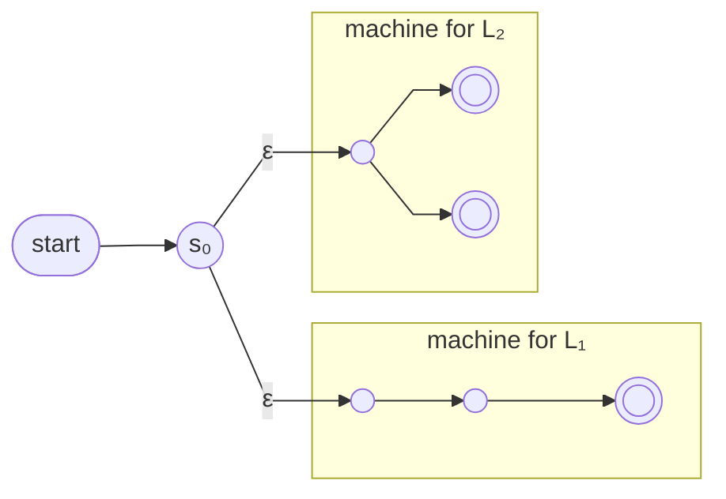

The [[Regular Language|regular languages]] are closed under **union**: L₁ ∪ L₂ = {s : s ∈ L₁ or s ∈ L₂}.

**Construction.** Given NFAs N₁ = (Q₁, Σ, δ₁, s₁, F₁) and N₂ = (Q₂, Σ, δ₂, s₂, F₂), build N:
- **States:** Q₁ ∪ Q₂ ∪ {s₀}, where s₀ is a new "joint" start state
- **Transitions:** all of δ₁ and δ₂, plus δ(s₀, ε) = {s₁, s₂}
- **Accepting:** F₁ ∪ F₂, unchanged
- s₁ and s₂ are demoted to ordinary states

On any input, N immediately splits into two computations — one per machine — and accepts if either accepts. This is the standard use of an [[Epsilon-Transition]].

*Union construction — new start s₀ with ε-arrows into both machines (slide 18)*

> [!note] Schematic machines
> The boxed machines are schematic: unlabelled arrows stand for arbitrary transitions, and the boxes mark machine boundaries. The construction must work for *any* such machines.

**The three checks** ([[Closure Property]])
1. **Language.** Every accepting path starts s₀ →ε s₁ or s₀ →ε s₂ and then lives entirely inside one machine, so N accepts s iff N₁ or N₂ does: L(N) = L₁ ∪ L₂
2. **Validity.** States, one start, ε-transitions, a set of accepting states — a legal NFA
3. **Generality.** The construction used no property of the two machines — a black box for any pair

> [!question] Two details of the construction
> 1. Why do s₁ and s₂ stop being start states? 2. Why do the accepting states stay exactly F₁ ∪ F₂?
>
> Answers — **1.** An NFA has exactly one start state; if s₁ or s₂ also started, the object wouldn't satisfy the definition. Their role survives through the ε-transitions. **2.** A string should be accepted exactly when some path through one of the original machines accepts it — the old accepting states already express this, and changing them would change the language.
