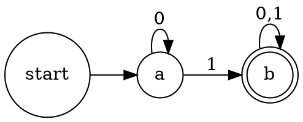

Every automaton diagram submitted in this course must be produced with software. **Hand-drawn diagrams are not accepted and receive no marks for that question.** Export as PNG or PDF and upload to Gradescope.

| | Option 1 · LaTeX with TikZ | Option 2 · Graphviz online editor |
|---|---|---|
| What it is | a typesetting language — how mathematicians and computer scientists write documents | the easy option: nothing to install, nothing to sign up for |
| Where | `overleaf.com` (runs in the browser) | `magjac.com/graphviz-visual-editor` |
| How | learning curve; tutorial at `latexdraw.com/automata-diagrams-in-latex` | describe the machine as text on the left, the diagram draws itself on the right |

Both are free, and either takes about an hour to learn.

**Graphviz worked example** — a DFA over {0, 1} accepting every string with at least one 1:

Paste it in, change it to match your own machine, export, upload. `rankdir=LR` lays the machine out left-to-right; `doublecircle` marks accepting states; the dangling `start` node gives the initial arrow.
