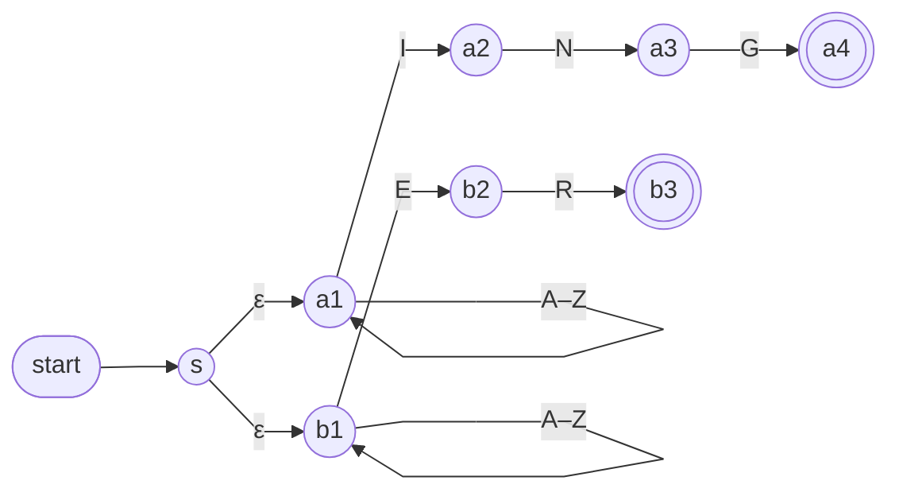

An **ε-transition** is a move an [[Non-deterministic Finite Automaton|NFA]] makes *without reading any input* — the arrow is labelled ε instead of a symbol. Formally it's a δ entry like δ(q, ε) = {r}: a thread in q may slide to r for free. ε-transitions can greatly simplify a design.

Their standard use is **running two machines as one, without merging their states.** A fresh start state with an ε-arrow into each machine splits the computation before any input is read; each branch then runs its own machine, and the NFA accepts if either one does.

*Strings over {A…Z} that end in ING or ER (slide 43)*

> [!note] State names
> The slide draws these states unlabelled; the names s, a₁–a₄, b₁–b₃ come from the traces later in the deck (slides 46, 49, 69).

- The two ε-arrows split the computation up front: one branch is assigned to ING, the other to ER
- Each branch waits in its own A–Z loop, then matches its own suffix
- The loops sit **before** the suffix chains — any prefix, then the suffix at the very end. A loop *after* a chain would be wrong: the match must end exactly at the end of the string

Because ε-arrows fire without input, the live states at any moment include everything reachable by ε — see [[Epsilon-Closure]].
