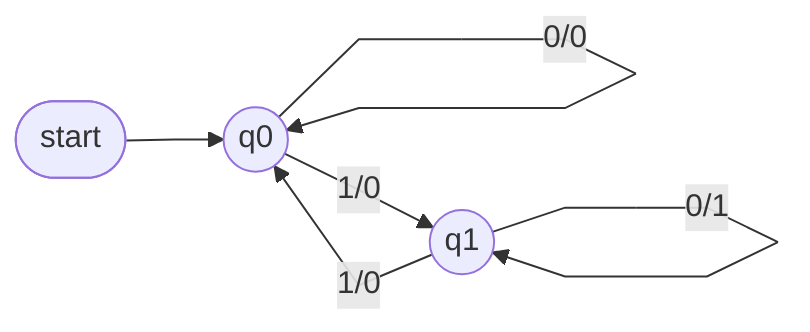

A **finite state transducer (FST)** is a [[Deterministic Finite Automaton]] for which output is defined — each edge is labelled `input/output` rather than just `input`. A **Mealy machine** is an example of a finite state transducer.

Where a DFA only answers accept/reject, a transducer also produces output as it runs. E.g. an FST over {0,1} that writes a 1 exactly when it reads a 0 in state q₁: feeding it `1001` traces q0→q1→q1→q1→q0 while writing `0110`.

This course focuses on yes/no (accept/reject) problems for now; the idea of output resurfaces later with Turing machines, which carry a "tape" that can leave behind a result.
