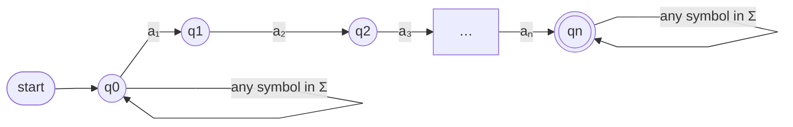

For any string s = a₁a₂…aₙ over an alphabet Σ, the [[Non-deterministic Finite Automaton|NFA]] accepting all strings that **contain** s always has the same shape: a chain spelling out s, a wait-loop on every symbol of Σ at the front, and a done-loop at the back.

*NFA accepting every string that contains a₁a₂…aₙ (slide 39)*

- **Wait-loop (front)** — lets the machine defer the start of the match. Drop it and only strings *beginning* with s are accepted
- **Done-loop (back)** — accepts any continuation after the match. Drop it and only strings *ending* in s are accepted
- Drop both and exactly the single string s is accepted
- Pattern of length n ⇒ **n + 1 states, always**

Compare the DFA for the same language (Example 5 in [[03 - Regular Languages and DFA Construction]]): every back-arrow there needs an argument about the longest surviving prefix. The NFA needs none — the wait-loop keeps a thread ready to start a fresh match at every position.
