# Lecture 3 — Regular Languages and DFA Construction

Wednesday, September 16. Today's arc: give DFAs output (transducers), name the class of languages DFAs recognize, then work through a strategy for building a DFA from a description — via six increasingly tricky worked examples.

> [!info]- Slide index — where each section comes from
> | Section of this note | Slides in the deck |
> |---|---|
> | **Finite State Transducers** | 2 Deterministic Finite Automata: An Example · 3 Finite State Transducer (FST) · 4 Trace: The Transducer on Input 1001 · 5 Finite State Transducer (FST) · 6 *DFAs Continued (divider)* |
> | ⤷ `Finite State Transducer` | 3 Finite State Transducer (FST) · 4 Trace: The Transducer on Input 1001 · 5 Finite State Transducer (FST) |
> | **Regular Languages** | 7 Regular Language |
> | ⤷ `Regular Language` | 7 Regular Language |
> | **Strategies for Creating DFAs** | 8 Strategies for Creating DFAs |
> | ⤷ `DFA Design Checklist` | 8 Strategies for Creating DFAs |
> | **Worked Examples** | 9–44 DFA Examples 1–6 (see below) |
> | ⤷ Example 1 — Odd 0s and Odd 1s | 9 DFA Example 1 · 10–12 DFA Example 1 Cont'd · 13–14 Trace: Example 1 |
> | ⤷ Example 2 — Minimising to Two States | 15 DFA Example 2 · 16 DFA Example 2 Cont'd · 17 Answer: The Two-State Machine |
> | ⤷ Example 3 — Divisible by Four | 18 DFA Example 3 · 19–23 DFA Example 3 Cont'd · 20 The Two Special Cases, Carefully · 24 Example 3 as a Table · 25 Trace: Example 3 on Four Inputs |
> | ⤷ Example 4 — Starts With Two 0s | 26 DFA Example 4 · 27–28 Check: Which of These Are Accepted? · 29–30 DFA Example 4 Cont'd |
> | ⤷ `Dead State` | 29–30 DFA Example 4 Cont'd |
> | ⤷ Example 5 — Contains 11010 | 31 DFA Example 5 · 32–33 What Is Missing From That Machine? · 34–35 DFA Example 5 Cont'd · 36 Reading the Back Arrows · 37 Trace: Example 5 on 11011010 · 38 Trace: Example 5 on 1100110 · 39 DFA Example 5 Cont'd |
> | ⤷ Example 6 — Reversing a Machine | 40 DFA Example 6 · 41–42 Two Questions About the Reversed Machine · 43–44 DFA Example 6 Cont'd |
> | ⤷ `Non-deterministic Finite Automaton` | 41–44 DFA Example 6 Cont'd |
> | *A Checklist for DFA Design (recap)* | 45 A Checklist for DFA Design |
> | **Practice: Ending in 01** | 46–47 Your Turn: Ending in 01 |
> | **Practice: At Least Two 1s** | 48–49 Your Turn: At Least Two 1s |
> | *Check Yourself* | 50–51 Check Yourself |
> | **Assignment 1** | 52 Assignment 1: This Friday |
> | *Summary and Next Steps* | 53 Summary and Next Steps |

## Finite State Transducers

The lecture opens by revisiting the familiar DFA (a two-state machine tracking parity of 1s) and asking how it differs from a Mealy machine — the answer is output.

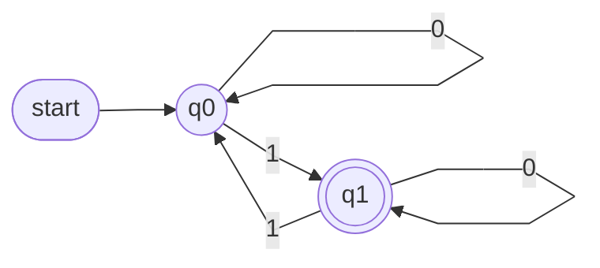

![[Finite State Transducer]]

## Regular Languages

![[Regular Language]]

## Strategies for Creating DFAs

Given an English or set-builder description of a language, how do you produce the DFA?

![[DFA Design Checklist]]

## Worked Examples

### Example 1 — Odd Number of 0s and Odd Number of 1s

States track the parity of 0s and 1s read so far: **EE, EO, OE, OO**. Start state EE (before any symbol, both counts are zero — even); accept state OO.

| δ | 0 | 1 |
|---|---|---|
| **EE** | OE | EO |
| **EO** | OO | EE |
| **OE** | EE | OO |
| **OO** | EO | OE |

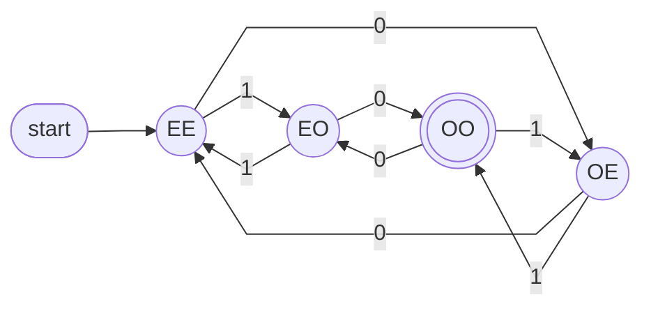

`1000` → EE→EO→OO→EO→OO, ends in OO, **accepted** (three 0s, one 1 — both odd). `110` → EE→EO→EE→OE, ends in OE, **rejected** (one 0 odd, two 1s even).

### Example 2 — Minimising to Two States

Variant: accept EE *or* OO (even+even or odd+odd — i.e., a string of even length). Reusing Example 1's machine and also accepting EE works:

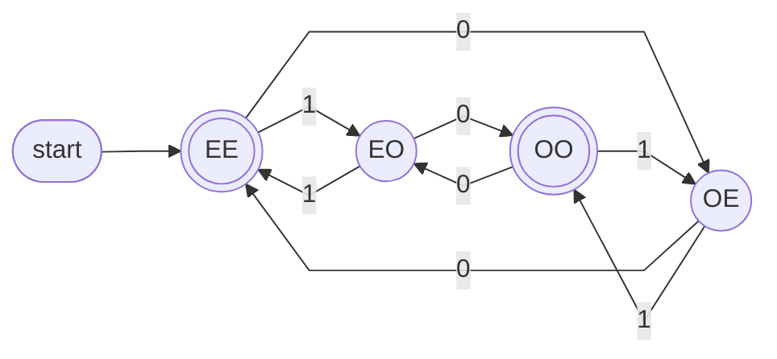

But every symbol flips exactly *one* parity, so "equal parities" and "different parities" are the only distinctions that matter — the four states collapse to two, EE/OO and EO/OE, each looping to the other on either symbol:

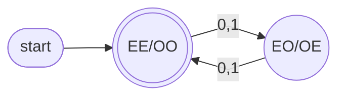

L = { s ∈ {0,1}* : |s| is even }

### Example 3 — Binary Integers Divisible by Four

States: **Initial, No 0's, One 0, Two 0's**. Start Initial; accept "Two 0's". Two special cases matter: the empty string isn't accepted (it isn't a binary integer at all), while a string of one-or-more 0's *is* accepted (it's the number zero, divisible by 4) — leading zeros are fine too (`0100` = 4).

| state | on 0 | on 1 |
|---|---|---|
| → Initial | Two 0's | No 0's |
| No 0's | One 0 | No 0's |
| One 0 | Two 0's | No 0's |
| * Two 0's | Two 0's | No 0's |

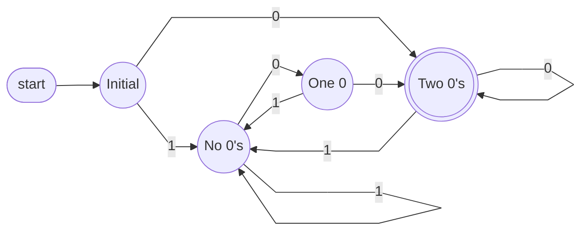

(→ marks start, \* marks accept.) Trace: `1100`→accept (12) · `10`→reject (2) · `0`→accept (0) · `0100`→accept (4) — note `0100` passes through the accepting state mid-string and then leaves it; only the state at the **end** of the string decides the answer.

### Example 4 — Strings That Start With Two 0s

States: **No 0's, One 0, Two 0's** (accept, self-loops on 0/1), and a **Dead** state (self-loops on 0/1) for anything that can no longer qualify.

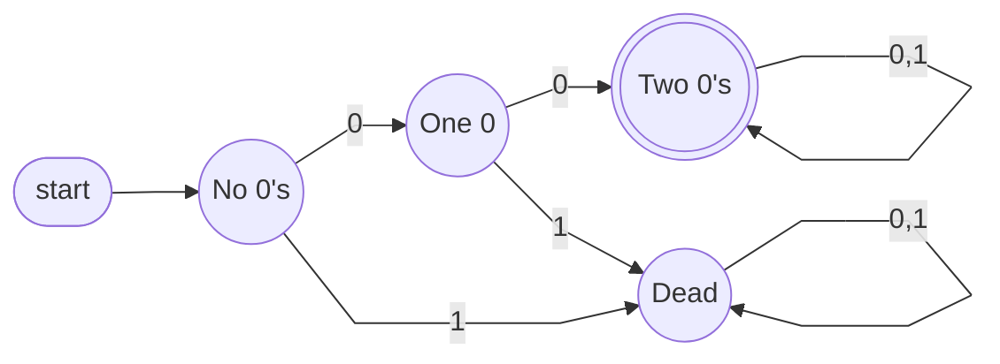

![[Dead State]]

`00`→accept · `0`→reject (only one 0 so far) · `01`→reject (the 1 came too early) · `001`→accept (already had two 0s) · `100`→reject (starts with a 1).

Once the dead state is understood, it's conventionally dropped from the drawing (missing arrows implicitly go to it):

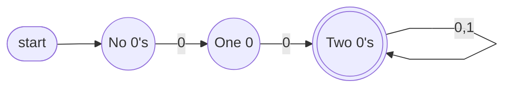

### Example 5 — Contains the Substring 11010

Six states s1..s6, where state sᵢ means "the first i−1 symbols of `11010` are matched so far." A mismatch doesn't always send you back to s1 — it goes to the *longest* prefix of `11010` still "alive" given the text just read.

| in state | matched | on 0 | on 1 |
|---|---|---|---|
| s1 | — | s1 | s2 |
| s2 | 1 | s1 | s3 |
| s3 | 11 | s4 | s3 |
| s4 | 110 | s1 | s5 |
| s5 | 1101 | s6 | s3 |
| * s6 | 11010 | s6 | s6 |

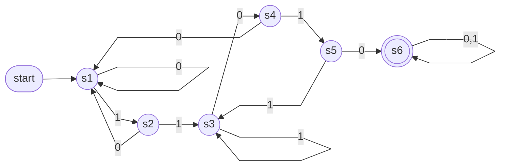

Trace `11011010`: s1→s2→s3→s4→s5→s3→s4→s5→s6, **accepted** (ends in `11010`). Trace `1100110`: s1→s2→s3→s4→s1→s2→s3→s4, **rejected** (no `11010` anywhere inside). This is an instance of string matching, an important application of finite automata — the Knuth–Morris–Pratt algorithm builds this kind of DFA in O(m·|Σ|) time for a pattern of length m.

### Example 6 — Reversing a Machine

Take the Example 5 machine, swap start ↔ accept, and reverse every arrow. It accepts the reverse of `11010`, i.e. `01011` — reversing a machine reverses its whole language. But the result is **not a DFA**: some states now have two arrows for the same symbol (non-deterministic choice), others have none. δ has stopped being a function.

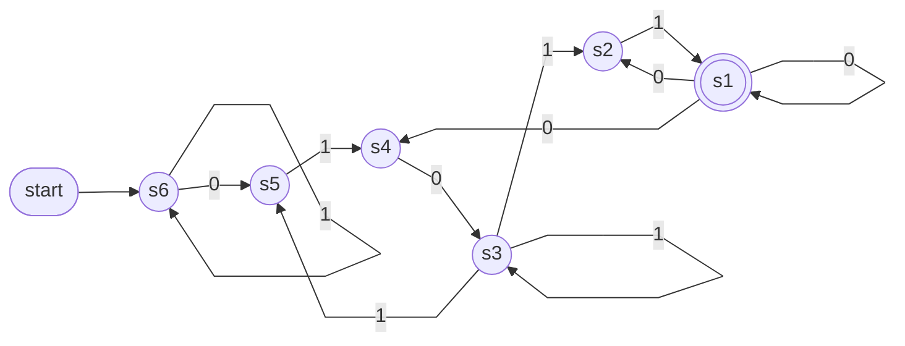

s6 (the new start state) has two arrows for `0` — it can stay put or move to s5 — and s1 has three, while s2, s4 and s5 each lack an arrow for one symbol entirely.

![[Non-deterministic Finite Automaton]]

## A Checklist for DFA Design

The lecture restates the [[DFA Design Checklist]] once all six examples are done, as the general recipe to reach for going forward.

## Practice: Ending in 01

Only needs to remember how much of `01` the string currently ends with: nothing, a `0`, or the whole thing.

| state | on 0 | on 1 |
|---|---|---|
| → none | ...0 | none |
| ...0 | ...0 | * ...01 |
| * ...01 | ...0 | none |

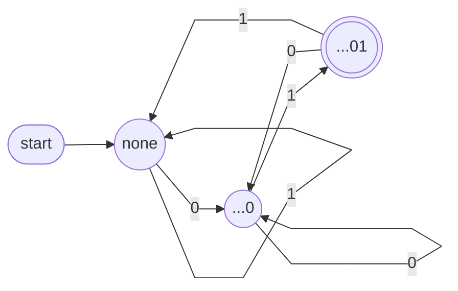

`01`, `101`, `0101` end accepted; `010` doesn't.

## Practice: At Least Two 1s

Counts 1s, but only up to two — beyond that, the exact number stops mattering.

| state | on 0 | on 1 |
|---|---|---|
| → zero | zero | one |
| one | one | two+ |
| * two+ | two+ | two+ |

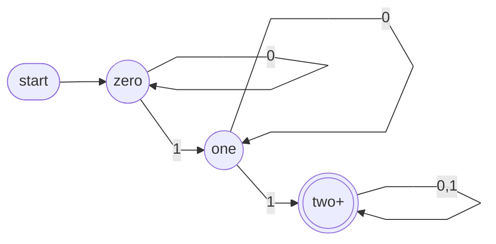

Three states suffice — a DFA can only remember a bounded amount, so the design work is really deciding what's worth remembering.

> [!question] Check Yourself
> 1. In Example 3, the machine passes through the accepting state while reading `0100`, but the answer is still decided at the end. Why?
> 2. True or false: every DFA diagram must draw a dead state.
> 3. In Example 5, why does a mismatch in state s5 send us to s3 rather than to s1?
> 4. What exactly goes wrong when we reverse the Example 5 machine?
>
> Answers — **1.** Acceptance is decided by the state the machine is in *after the last symbol*; visiting an accepting state partway through means nothing. **2.** False — a DFA need not have a dead state at all (the two-state machine in Example 2 has none); δ just has to be total, and omitted transitions are read as going to a dead state where one is used. **3.** After that mismatch the text ends in `11011`, whose last two symbols `11` are still a beginning of `11010` — going all the way to s1 would throw away a real partial match. **4.** δ stops being a function: some states gain several arrows for one symbol, others lose one entirely.

## Assignment 1

- Released Friday, September 18, in the tutorial; due Tuesday, September 29, 11:55 pm, on Gradescope
- Question 1 gives a DFA as a transition table: draw it, describe its language, and decide which strings it accepts — the same skills as today's six worked examples
- Diagrams must be produced with software — see [[Drawing Automata]]
- Join Gradescope before Friday if you haven't: `gradescope.ca`, entry code `9NY2RE`

## Summary and Next Steps

Today: transducers (and why this course sticks with accept/reject for now), regular languages, and a checklist for designing DFAs, applied across six worked designs — parity, minimisation, divisibility, a dead state, string matching, and a reversal. Friday: first tutorial (Assignment 1, drawing tools, Gradescope). Monday: the machine that took two arrows at once gets a name and a definition — non-determinism — plus a proof that it buys no extra power.
