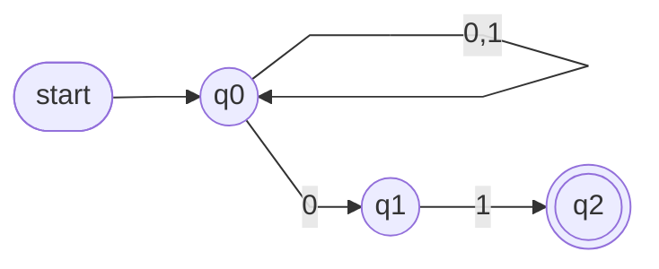
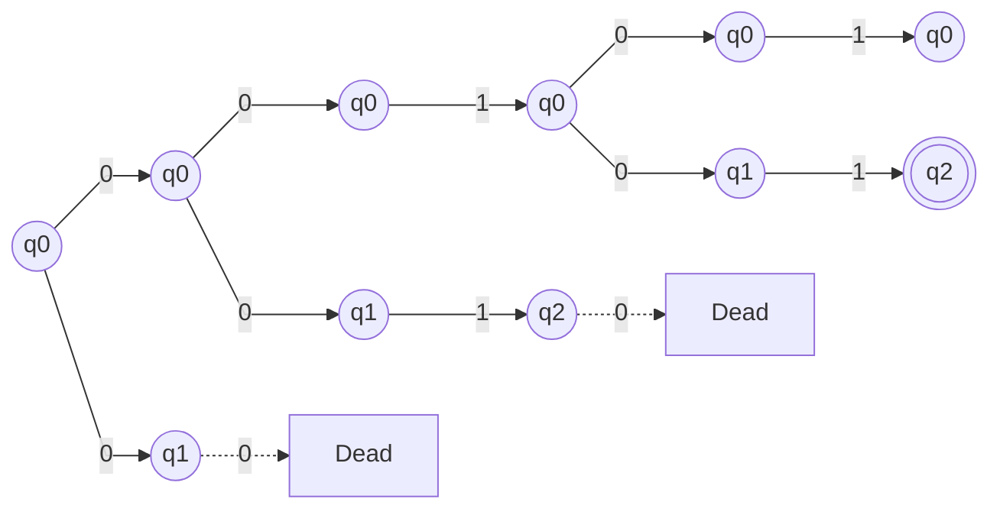
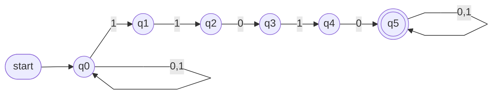
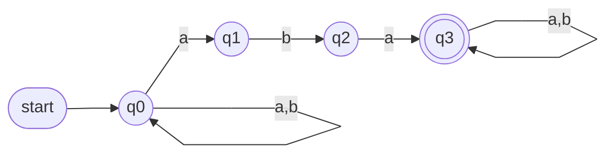
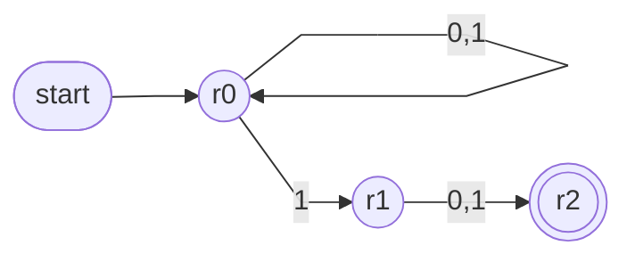
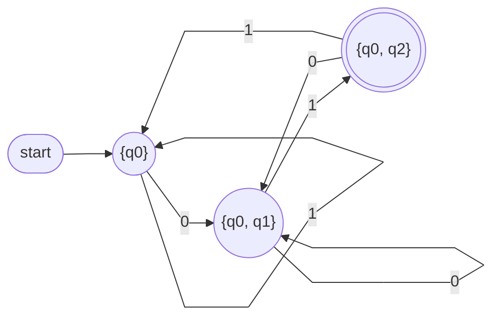
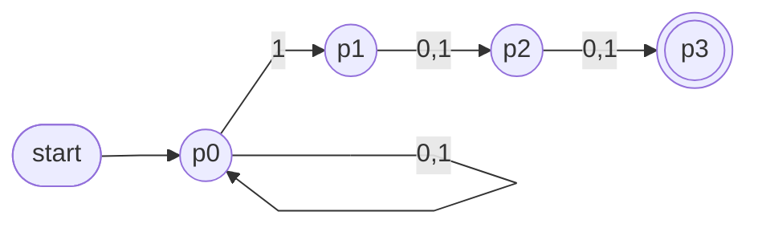
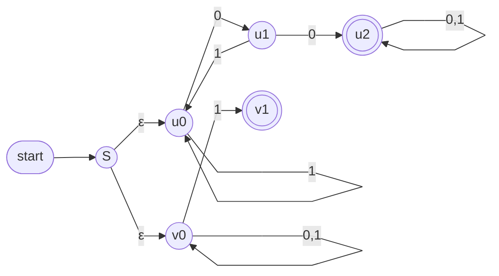
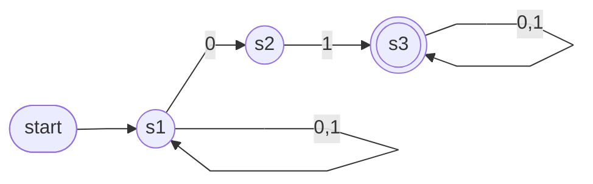

# Lecture 4 — Non-determinism and NFAs

Monday, September 21. Today's arc: finish last lecture's two practice designs, then answer the question the reversed machine raised — what if a machine could take both arrows at once? That's non-determinism, and a new machine, the NFA. By the end, everything Assignment 1 needs is on the table.

> [!info]- Slide index — where each section comes from
> | Section of this note | Slides in the deck |
> |---|---|
> | *Intro* | 2 Review, and Today's Outline |
> | **Leftover Practice from Lecture 3** | 3–4 Exercise: Strings Ending in 01 · 5–6 Exercise: At Least Two 1s · 7 Remark: The Ends-in-01 DFA |
> | **Non-Determinism** | 8 *part divider* · 10–11 Question: The Reversed Machine |
> | ⤷ `Non-determinism` | 9 Determinism vs. Non-Determinism · 12 Determinism vs. Non-Determinism · 13 The Acceptance Criterion |
> | **Non-deterministic Finite Automata** | 14–23 |
> | ⤷ `Non-deterministic Finite Automaton` | 14 Non-deterministic Finite Automaton · 15 Comparison: DFA and NFA · 16 Non-deterministic Finite Automata (NFA) · 17–18 Question: What Changed in the Definition? · 19 Non-deterministic Finite Automata (NFA) · 20 Reading δ's Set Values · 21 Acceptance, Formally · 22–23 Question: The Role of Σε · 55 Exercise: Classifying Three Machines |
> | **NFA Example 1 — Ends in 01** | 24 NFA Example 1 📊 · 25–26 Exercise: Reading the Transition Table · 27 Same Language, Two Machines · 28 NFA Example 1 Cont'd 📊 · 30–31 Exercise: Run 0110 by Sets |
> | ⤷ `Set View of an NFA` | 29 The Set View of the Same Run · 31 Exercise: Run 0110 by Sets |
> | **NFA Example 2 — Contains 11010** | 32–33 NFA Example 2 📊 · 34 Exercise: The Transition Table of Example 2 · 35 The Transition Table of Example 2 · 36 Trace: 111010 by Sets · 37 NFA Example 2 Cont'd · 38 Design Effort versus Execution Effort |
> | **NFA String Matching** | 40–41 Exercise: Contains aba 📊 |
> | ⤷ `NFA String Matching` | 33 NFA Example 2 · 39 NFA String Matching 📊 · 41 Exercise: Contains aba |
> | **ε-Transitions** | 45–46 Exercise: Trace RING |
> | ⤷ `Epsilon-Transition` | 20 Reading δ's Set Values · 42 ε-Transitions · 43 ε-Transitions 📊 · 44 The Role of the ε-Transitions |
> | ⤷ `Epsilon-Closure` | 47 ε-Closure · 48–49 Exercise: Two Closures |
> | **Two Interpretations of Non-determinism** | 50–51 |
> | ⤷ `Interpretations of Non-determinism` | 50 Non-determinism: Two Interpretations · 51 Using the Two Interpretations |
> | **Practice: The Second-to-Last Symbol** | 52–53 Exercise: The Second-to-Last Symbol 📊 |
> | **Practice: Classifying Three Machines** | 54–55 Exercise: Classifying Three Machines |
> | **Toward Wednesday: Sets as States** | 56–57 Toward Wednesday: Sets as States 📊 |
> | *Review Questions* | 58–59 Review Questions |
> | **Assignment 1** | 60 Assignment 1: Due Next Tuesday |
> | *Summary and Next Steps* | 61 Summary and Next Steps |
> | **Additional Exercises** | 62–63 The Third-to-Last Symbol 📊 · 64–65 Union via ε-Transitions 📊 · 66–67 From Table to Diagram 📊 · 68–69 Trace PER and RINGS |

## Leftover Practice from Lecture 3

The two practice designs Lecture 3 didn't reach — **ending in 01** and **at least two 1s** — are worked, with diagrams, in [[03 - Regular Languages and DFA Construction#Practice: Ending in 01|Lecture 3's notes]]. The takeaway from the second: three states suffice, because a DFA can only remember a bounded amount — the design work is deciding what's worth remembering.

> [!note] Remark — the ends-in-01 DFA
> That DFA took care: from the accepting state, a 0 must go back to "...0", not to the start, because it may begin the next 01. Every arrow had to be exactly right, since a DFA provides exactly one computation per input. Today the same language is recognized by a machine that is far simpler to design — because it's allowed to **guess**.

## Non-Determinism

> [!question] The reversed machine (recap)
> Reversing Lecture 3's `11010` machine produced something that wasn't a DFA — two requirements were violated at once, one about too many arrows and one about too few. State both precisely.
>
> Answer — **1.** Some states had several arrows for the same symbol (the start state could stay put *or* move on a 0). **2.** Other states had no arrow at all for some symbol. Both break the same rule: in a DFA, δ gives exactly one next state for every state and symbol. Today these stop being defects and become part of the definition of a new machine.

![[Non-determinism]]

## Non-deterministic Finite Automata

![[Non-deterministic Finite Automaton]]

## NFA Example 1 — Strings Ending in 01

*NFA accepting strings that end in 01 (slide 24)*

Formally A = ({q₀, q₁, q₂}, {0, 1}, δ, q₀, {q₂}), where

| δ    | 0        | 1    |
| ---- | -------- | ---- |
| → q₀ | {q₀, q₁} | {q₀} |
| q₁   | ∅        | {q₂} |
| q₂   | ∅        | ∅    |

> [!question] Reading the transition table
> 1. δ(q₀, 0) = ? What does it mean that this set has two elements?
> 2. δ(q₁, 0) = ? What happens to a thread sitting in q₁ when a 0 arrives?
> 3. Which row would already be illegal in a DFA?
>
> Answers — **1.** {q₀, q₁}: on a 0 the computation branches — one path stays in q₀ (the 0 is ordinary input), one moves to q₁ (the 0 is the start of the final 01). **2.** ∅: that path terminates — it needed a 1 and didn't get one. **3.** Every row breaks a DFA rule somewhere: q₀ has two 0-arrows, q₁ and q₂ have missing arrows. All three are legal NFA rows.

**Same language, two machines.** Lecture 3's DFA for this language also had three states, but every one of its six arrows had to be placed with care — especially the one out of the accepting state. This NFA has four arrows and mirrors the description directly: wait anywhere, then read 0, then read 1. The NFA moves the work from design time to run time — the branching still has to be resolved eventually, and the algorithm that does it arrives Wednesday.

*Every computation path of the NFA on input 00101 (slide 28) — dashed arrows are threads that die for lack of an arrow*

One thread ends in q₂ with the input used up, so the computation **accepts**.

![[Set View of an NFA]]

The same run, one level of the tree at a time:

| after reading | live states |
|---|---|
| ε | {q₀} |
| 0 | {q₀, q₁} |
| 00 | {q₀, q₁} |
| 001 | {q₀, q₂} |
| 0010 | {q₀, q₁} |
| 00101 | {q₀, q₂} |

q₂ is in the final set, so `00101` is accepted. This table is the central idea of Wednesday's lecture.

> [!question] Run 0110 by sets
> Start from {q₀} and read `0110` one symbol at a time. Accepted or rejected?
>
> Answer — {q₀} →⁰ {q₀, q₁} →¹ {q₀, q₂} →¹ {q₀} →⁰ {q₀, q₁}. No q₂ at the end, so **rejected** — and indeed it doesn't end in 01. After `01` the set *did* contain q₂, but passing through an accepting possibility mid-string means nothing.

## NFA Example 2 — Strings Containing 11010

*NFA accepting every string that contains 11010 (slide 32)*

> [!question] What are the loops on q₀ and q₅ for?
> How would the language change if either were omitted?
>
> Answer — The q₀ loop lets the machine defer the start of the match; the q₅ loop accepts any continuation after it. Omit the q₀ loop: only strings *beginning* with 11010. Omit the q₅ loop: only strings *ending* in 11010. Omit both: exactly the single string 11010.

| δ | 0 | 1 |
|---|---|---|
| → q₀ | {q₀} | {q₀, q₁} |
| q₁ | ∅ | {q₂} |
| q₂ | {q₃} | ∅ |
| q₃ | ∅ | {q₄} |
| q₄ | {q₅} | ∅ |
| * q₅ | {q₅} | {q₅} |

Cells worth checking: δ(q₀, 1) = {q₀, q₁} — the branch again: stay in q₀, or begin the match · δ(q₁, 0) = ∅ — that branch terminates · δ(q₅, 0) = {q₅} — after a match, every continuation is accepted. Assignment 1 asks for the opposite direction — the diagram *from* the table; same correspondence, applied in reverse.

**Trace `111010` by sets:**

| after | live states |
|---|---|
| 1 | {q₀, q₁} |
| 11 | {q₀, q₁, q₂} |
| 111 | {q₀, q₁, q₂} |
| 1110 | {q₀, q₃} |
| 11101 | {q₀, q₁, q₄} |
| 111010 | {q₀, q₅} |

After `11` the machine keeps three branches alive at once — the match might begin at position 1, at position 2, or later. q₅ survives at the end: **accepted**, and indeed `111010` contains `11010` starting at position 2.

**Design effort versus execution effort.** Compare the equivalent DFA from [[03 - Regular Languages and DFA Construction#Example 5 — Contains the Substring 11010|Lecture 3, Example 5]]:

| | DFA | NFA |
|---|---|---|
| Shape | five back-arrows, each needing an argument about the longest surviving prefix | two loops and a straight line |
| Design | demanding | simple |
| Execution | trivial | must track many parallel branches |

Wednesday removes the trade-off: an algorithm converts any NFA into an equivalent DFA, mechanically. *Design with the NFA; execute as the DFA.*

## NFA String Matching

![[NFA String Matching]]

> [!question] Contains aba
> Using the pattern, give an NFA over {a, b} accepting all strings containing `aba`. How many states? How many arrows?
>
> Answer — four states, five arrows: a chain for `aba`, a wait-loop in front, a done-loop at the back (diagram below).

*Answer: NFA for strings containing aba (slide 41)*

## ε-Transitions

![[Epsilon-Transition]]

**Trace `RING` by sets.** Careful with the very first step: the ε-arrows fire before any input is read, so the live set starts at {s, a₁, b₁}.

| after | live states |
|---|---|
| ε | {s, a₁, b₁} |
| R | {a₁, b₁} |
| RI | {a₁, a₂, b₁} |
| RIN | {a₁, a₃, b₁} |
| RING | {a₁, a₄, b₁} |

a₄ is accepting, so `RING` is **accepted** — the ING branch succeeds while the ER branch stays in its loop. s itself drops out after the first symbol: it has no ordinary arrows.

![[Epsilon-Closure]]

## Two Interpretations of Non-determinism

![[Interpretations of Non-determinism]]

## Practice: The Second-to-Last Symbol

Design an NFA over {0, 1} accepting exactly the strings whose second-to-last symbol is a 1. *Hint: let the machine guess the moment when exactly two symbols remain.*

*Answer (slide 53)*

- Wait in r₀; on some 1, guess that it's the second-to-last symbol; read one more and stop
- A branch that guesses wrong terminates without affecting the outcome — the acceptance criterion needs only one correct branch
- Three states. A DFA needs four, because it must *remember* the last two symbols instead of guessing

## Practice: Classifying Three Machines

> [!question] Valid DFA, valid NFA, or neither? (machines over {0, 1})
> 1. Every state has exactly one 0-arrow and one 1-arrow; no ε
> 2. One state has two 1-arrows; every other row is DFA-like
> 3. One arrow is labelled ε; some rows are empty; one row has two entries
>
> Answers — **1.** A valid DFA — and therefore also a valid NFA (every DFA is an NFA that never uses its freedoms). **2.** Not a DFA (two arrows for one symbol), but a perfectly good NFA. **3.** Also a perfectly good NFA — ε-arrows, empty rows and multiple entries are all legal.

## Toward Wednesday: Sets as States

Only three different sets ever appeared in today's ends-in-01 traces — {q₀}, {q₀, q₁}, {q₀, q₂} — and every step moved *deterministically* from one set to the next. So: make each **set** a single state of a new machine, with arrows taken straight from the traces.

*The ends-in-01 NFA's live sets, turned into states (slide 57)*

One arrow per state per symbol, no ε: this is a DFA — and it's exactly Lecture 3's ends-in-01 DFA with new state names ({q₀} = none, {q₀, q₁} = ...0, {q₀, q₂} = ...01). A first instance of Wednesday's subset construction.

> [!question] Review Questions
> 1. An NFA reads a symbol in a state with no arrow for it. What happens to that thread? To the whole computation?
> 2. True or false: an NFA rejects w as soon as one of its threads dies.
> 3. What is E({q}) if no ε-arrow leaves q?
> 4. True or false: every DFA is an NFA.
>
> Answers — **1.** That path terminates. The computation as a whole is unaffected unless it was the last live path — acceptance needs one accepting path at the end. **2.** False — rejection is a verdict about *all* threads, delivered only at the end of the string. **3.** E({q}) = {q} — the closure always contains the set itself. **4.** True — a DFA is an NFA whose δ-sets all have exactly one element and which never uses ε. Wednesday builds on exactly this.

## Assignment 1

- Due **Tuesday, September 29, 11:55 pm** on Gradescope (`gradescope.ca`, entry code `9NY2RE`)
- As of today, everything A1 needs has been covered — **Question 4 (build an NFA)** is exactly today's skill
- Diagrams must be produced with software (Graphviz or TikZ) — see [[Drawing Automata]]
- Friday's tutorial is the place for A1 questions — bring drafts

## Summary and Next Steps

Today: non-determinism (many parallel paths; a single accepting path suffices), the NFA five-tuple with δ : Q × Σε → 𝒫(Q) and acceptance via *some* path, and the machines — ends-in-01, contains-11010, suffix machines with ε — plus the set view of running an NFA. Wednesday: the **subset construction** — every NFA has an equivalent DFA, built mechanically. Today's three-set machine was a first instance.

## Additional Exercises

### The Third-to-Last Symbol

Design an NFA over {0, 1} accepting the strings whose third-to-last symbol is 1. Then: roughly how many states would a DFA need, and why?

*Answer (slide 63)*

- Four NFA states: guess "three symbols remain", then count them down
- A DFA must remember the last three symbols — 2³ = 8 combinations, so 8 states. The gap between n + 1 and 2ⁿ is the price of determinism, and Wednesday's construction shows exactly where it comes from

### Union via ε-Transitions

Over {0, 1}: give an NFA accepting the strings that contain 00 **or** end in 1. *Hint: a machine for each half is already known — connect them rather than merging their states.*

*Answer (slide 65) — upper branch: contains 00 · lower branch: ends in 1*

- One ε-fork at the front runs both machines at once; accept if either half accepts
- This construction — union via ε — returns as a theorem when closure properties are studied next week

> [!warning] Partly cut off on the slide
> The last bullet of slide 65 runs off the bottom of the page; "returns as a theorem when we study closure properties next week" is the most likely reading — check against the lecture.

### From Table to Diagram

Assignment 1 presents machines as tables. An NFA over {0, 1} with start state s₁, F = {s₃}:

| δ | 0 | 1 |
|---|---|---|
| → s₁ | {s₁, s₂} | {s₁} |
| s₂ | ∅ | {s₃} |
| * s₃ | {s₃} | {s₃} |

1. Draw the state diagram. 2. Which of `001`, `010`, `0110`, `100` are accepted? 3. Describe the language in one sentence.

*Answer (slide 67)*

- `001`, `010` and `0110` are accepted; `100` is rejected
- The language: all strings **containing** 01
- Compare with Example 1: the only difference is the loop on the accepting state — that one loop turns *ends in 01* into *contains 01*

### Trace PER and RINGS

For the ING/ER machine in [[Epsilon-Transition]], trace both words by sets. Which is accepted? For the rejected one, identify the exact step where the successful branch is lost.

| after | live states |
|---|---|
| ε | {s, a₁, b₁} |
| P | {a₁, b₁} |
| PE | {a₁, b₁, b₂} |
| PER | {a₁, b₁, b₃} |

| after | live states |
|---|---|
| RING | {a₁, a₄, b₁} |
| RINGS | {a₁, b₁} |

- `PER`: b₃ is accepting, so **accepted** — the ER branch succeeds
- `RINGS`: after `RING` the set contains a₄, but the final `S` eliminates it — a₄ has no outgoing arrows. **Rejected**
- This is the machine enforcing *ends in* ING, not *contains* ING: the match must coincide with the end of the string
