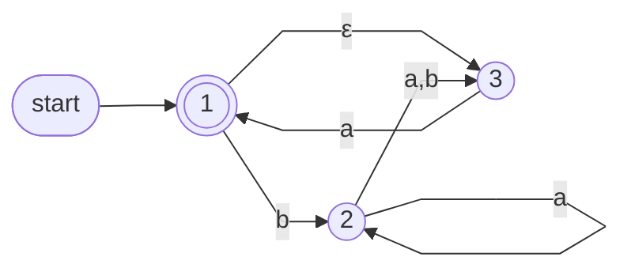
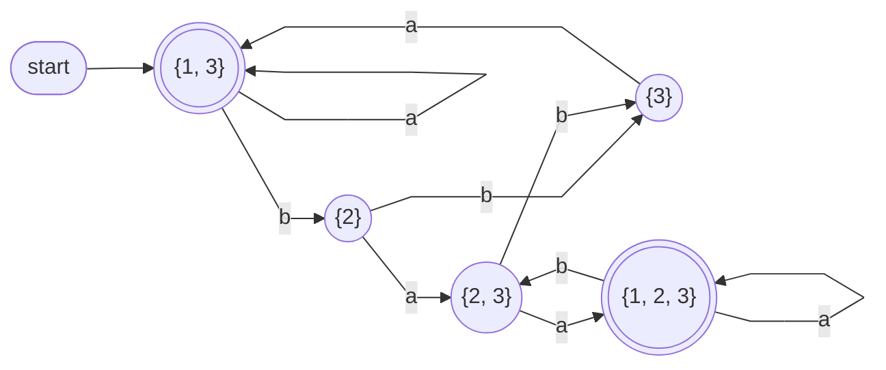
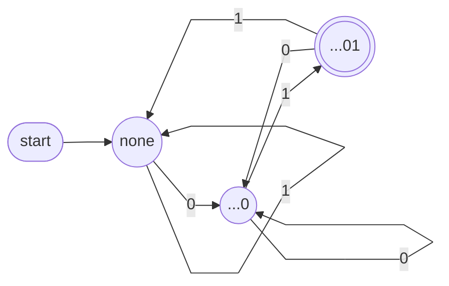

# Lecture 5 — From NFA to DFA: The Subset Construction

Wednesday, September 23. Today's arc: Monday's observation that an NFA's *sets* of live states behave like states is made precise, proved, and turned into an algorithm. Result: NFAs and DFAs recognize exactly the same languages.

> [!info]- Slide index — where each section comes from
> | Section of this note | Slides in the deck |
> |---|---|
> | *Review* | 2 Review: Non-deterministic Finite Automata |
> | **Non-determinism Continued** | 3 *part divider* |
> | ⤷ `Equivalence of NFAs and DFAs` | 4 Equivalence of NFAs and DFAs · 5 Question: Why Is Every DFA an NFA? · 6 Equivalence of NFAs and DFAs · 7 Question: Why Is Every DFA an NFA? · 8 Equivalence of NFAs and DFAs · 9 Equivalence of NFAs and DFAs · 35 Equivalence of DFAs and NFAs · 36 Consequences of the Corollary |
> | **Converting NFAs into DFAs** | 10–18 |
> | ⤷ `Subset Construction` | 10–11 Converting NFAs into DFAs · 12–13 Exercise: Counting the Subset States · 14 Converting NFAs into DFAs · 16–17 Converting NFAs into DFAs · 18 The Subset Construction: The Algorithm · 24 Question: The Start State · 26 Example 1 · 29 Exercise: Verify Two Entries · 32 Question: The Empty Entries · 34 Verification · 41 Additional Exercise: A Second Conversion · 43 Additional Exercise: Why Eight States Are Required · 45 Review Questions |
> | ⤷ `Epsilon-Closure` (updated) | 15 ε-Closure, Stated Fully |
> | **Example 1** | 19 Example 1 📊 · 20–21 Exercise: The Transition Table of the NFA · 22 Example 1 · 23–24 Question: The Start State · 25–27 Example 1 · 28–29 Exercise: Verify Two Entries · 30 Example 1 (Minimization) · 31–32 Question: The Empty Entries · 33 Example 1 📊 · 34 Verification: Input baba on Both Machines |
> | ⤷ `Dead State` (updated) | 32 Question: The Empty Entries |
> | **Exercise: Convert the Ends-in-01 NFA** | 37–38 Exercise: Convert the Ends-in-01 NFA · 39 The Construction Recovers the Hand-Built DFA 📊 |
> | **Additional Exercises** | 40–41 A Second Conversion · 42–43 Why Eight States Are Required |
> | *Review Questions* | 44–45 Review Questions |
> | **Assignment 1** | 46 Assignment 1: Due Tuesday |
> | *Summary and Next Steps* | 47 Summary and Next Steps |

## Review

An NFA may have several arrows per symbol, missing arrows, and ε-arrows (δ : Q × Σε → 𝒫(Q)), and it accepts when at least one computation path reaches an accepting state. Monday's run of the ends-in-01 NFA by sets:

{q₀} →⁰ {q₀, q₁} →⁰ {q₀, q₁} →¹ {q₀, q₂} →⁰ {q₀, q₁} →¹ {q₀, q₂} — accept

The sets behave like states. Today makes that precise.

## Equivalence of NFAs and DFAs

![[Equivalence of NFAs and DFAs]]

## Converting NFAs into DFAs

![[Subset Construction]]

![[Epsilon-Closure]]

## Example 1

Convert this NFA to an equivalent DFA.

*Example 1 NFA over {a, b} — start and accepting state 1 (slide 19)*

**Read the diagram into a table first** (slides 20–21) — entries are sets, and ∅ is allowed:

| δ | a | b | ε |
|---|---|---|---|
| → * 1 | ∅ | {2} | {3} |
| 2 | {2, 3} | {3} | ∅ |
| 3 | {1} | ∅ | ∅ |

State 1 has no a-arrow (this matters below) · state 2 on a has two successors, the loop and the arrow to 3 · the only ε-arrow is 1 → 3.

**The components**
- **States:** QD ⊆ 𝒫({1, 2, 3})
- **Alphabet:** ΣD = ΣN = {a, b}
- **Start state:** E({1}) = {1, 3}, because of the ε-transition 1 → 3
- **Accepting states:** FN = {1}, so FD = {{1}, {1, 2}, {1, 3}, {1, 2, 3}}

> [!question] The start state
> 1. The DFA's start state is {1, 3}, not {1}. Why exactly? 2. Why is E({2}) just {2}?
>
> Answers — **1.** Before reading any input, the NFA may already take 1 →ε 3, so both 1 and 3 are live initially: E({1}) = {1, 3}. **2.** No ε-arrow leaves 2, so the closure adds nothing.

**Part 1 — single-state rows**, closures included:

| | a | b |
|---|---|---|
| {1} | ∅ | {2} |
| {2} | {2, 3} | {3} |
| {3} | {1, 3} | ∅ |

> [!warning] The critical cell — {3} on a
> The arrow gives 3 →ᵃ 1, but from 1 an ε-move to 3 is free, so the entry is E({1}) = {1, 3}, not {1}. The closure applies after *every* step.

**Part 2 — combined rows**, as unions of single rows (→ start, * accepting):

| δD | a | b |
|---|---|---|
| * {1} | ∅ | {2} |
| {2} | {2, 3} | {3} |
| {3} | {1, 3} | ∅ |
| * {1, 2} | {2, 3} | {2, 3} |
| → * {1, 3} | {1, 3} | {2} |
| {2, 3} | {1, 2, 3} | {3} |
| * {1, 2, 3} | {1, 2, 3} | {2, 3} |

> [!question] Verify two entries
> 1. δD({1, 2}, b) = ? 2. δD({1, 2, 3}, a) = ?
>
> Answers — **1.** δD({1}, b) ∪ δD({2}, b) = {2} ∪ {3} = {2, 3} ✓ **2.** ∅ ∪ {2, 3} ∪ {1, 3} = {1, 2, 3} ✓

**Drop the unreachable states.** Looking down the columns, no state/symbol pair ever leads to {1} or {1, 2}, and neither is the start state — so they can never be reached and are eliminated.

> [!warning] "Minimization" on slide 30
> The deck heads this step *Minimization*, but what's done here is only discarding **unreachable** states (step 5 of the algorithm, "Restrict"). Proper DFA minimization — merging states that behave identically — is a separate, stronger procedure.

> [!question] The empty entries
> Two cells are empty (∅): {1} on a and {3} on b. 1. What do they mean for the NFA's computation paths? 2. Which DFA state do they point to, and why may it stay undrawn?
>
> Answers — **1.** Every live path terminates on that symbol — nothing stays live, and no later input can change that. **2.** ∅, the empty subset: the subset DFA's [[Dead State|dead state]]. It's omitted by the usual convention — a missing arrow means "fall into the dead state and stay."

*The resulting DFA — the unreachable {1}, {1, 2} and the dead state ∅ are not drawn (slide 33)*

> [!note] "5 of 8"
> The slides say this example reaches 5 of its 8 subsets. That counts the drawn states only — ∅ is reachable too ({3} on b), so strictly it's 6 of 8 with the dead state included.

**Verification — `baba` on both machines:**

| after | NFA live set | DFA state |
|---|---|---|
| ε | {1, 3} | {1, 3} |
| b | {2} | {2} |
| ba | {2, 3} | {2, 3} |
| bab | {3} | {3} |
| baba | {1, 3} | {1, 3} |

The columns agree at every step — by construction they always will. {1, 3} contains the accepting state 1, so both machines **accept** `baba`. That column-for-column agreement is the proof that the conversion preserves the language.

## Exercise: Convert the Ends-in-01 NFA

Convert Lecture 4's ends-in-01 NFA (table in [[04 - Non-determinism and NFAs#NFA Example 1 — Strings Ending in 01|Lecture 4's notes]]; no ε-transitions). Generate only the reachable subsets — how many are needed, and which accept?

| | 0 | 1 |
|---|---|---|
| → {q₀} | {q₀, q₁} | {q₀} |
| {q₀, q₁} | {q₀, q₁} | {q₀, q₂} |
| * {q₀, q₂} | {q₀, q₁} | {q₀} |

- Only three of the 2³ = 8 subsets are ever reached
- Accepting: exactly the subsets containing q₂ — here just {q₀, q₂}
- No empty cells: some state is always live, thanks to the q₀ loop

*Renamed: {q₀} = "none", {q₀, q₁} = "...0", {q₀, q₂} = "...01" (slide 39)*

This is, arrow for arrow, the DFA designed by hand in [[03 - Regular Languages and DFA Construction|Lecture 3]] — the construction re-derived it, exactly as the equivalence theorem guarantees.

## Additional Exercises

### A Second Conversion

Convert Lecture 4's "second-to-last symbol is 1" NFA. How many reachable subset states? (Lecture 4 claimed a DFA needs four.)

| δ | 0 | 1 |
|---|---|---|
| → r₀ | {r₀} | {r₀, r₁} |
| r₁ | {r₂} | {r₂} |
| * r₂ | ∅ | ∅ |

*Answer (slide 41)*

| | 0 | 1 |
|---|---|---|
| → {r₀} | {r₀} | {r₀, r₁} |
| {r₀, r₁} | {r₀, r₂} | {r₀, r₁, r₂} |
| * {r₀, r₂} | {r₀} | {r₀, r₁} |
| * {r₀, r₁, r₂} | {r₀, r₂} | {r₀, r₁, r₂} |

- Exactly four reachable subsets — the count Lecture 4 claimed
- The subsets *are* the DFA's memory: r₁ is present exactly when the last symbol was 1, r₂ exactly when the second-to-last was 1

### Why Eight States Are Required

The third-from-the-end NFA (Lecture 4) has 4 states, so its subset DFA has at most 2⁴ = 16. Lecture 4 claimed the DFA needs 8. What does 8 correspond to?

**Answer.** The DFA must remember the last three symbols: 2 × 2 × 2 = 8 combinations, and no two can be merged — some future ending tells any two apart. The subset construction reaches exactly those 8 subsets. Techniques for proving such lower bounds come later in the course.

> [!question] Review Questions
> 1. What is the start state of the subset DFA, in one formula?
> 2. When is a subset state accepting?
> 3. An NFA has 4 states. At most how many states can its subset DFA have — and how many will it typically reach?
> 4. Does the conversion ever change the language?
>
> Answers — **1.** E({q₀}) — the start state plus its full ε-reach. **2.** Exactly when it contains at least one NFA accepting state — some computation path has reached acceptance. **3.** At most 2⁴ = 16, counting ∅. Usually far fewer, since only reachable subsets are built (today's examples: 5 and 3, not counting ∅). **4.** Never — the DFA state is always the set of live NFA states, so the machines agree on every input.

## Assignment 1

- Due **Tuesday, September 29, 11:55 pm** on Gradescope
- Everything on it has now been taught. New verification method: after designing an NFA, convert part of it and confirm the resulting DFA matches the intended language
- Diagrams must be produced with software — see [[Drawing Automata]]

## Summary and Next Steps

Today: every DFA is an NFA (by definition); every NFA has an equivalent DFA (by the subset construction — closure at the start, closure after every hop, unions for combined rows, accept on any accepting member). Example 1 was converted, verified, and restricted to its reachable states; the ends-in-01 NFA converted back into Lecture 3's hand-built DFA. **Next lecture:** with DFA = NFA in hand, operations on whole languages — unions, concatenations, stars — and regular expressions.

## Notes to Self

- Bring A1 drafts to the **Friday, September 25** tutorial
- Sanity-check each A1 NFA by partially converting it to a DFA before submitting
