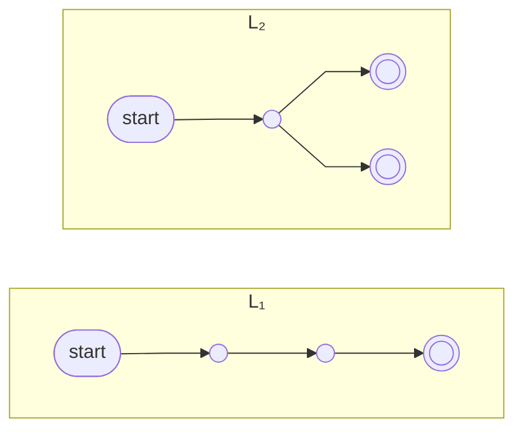
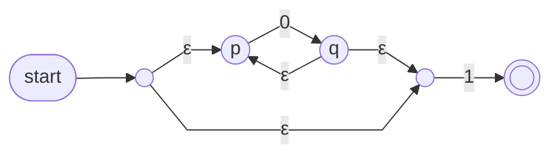

# Lecture 6 — Closure Properties and Regular Expressions

Monday, September 28. With DFA = NFA settled in Lecture 5, today moves up a level: operations on *whole languages* (union, concatenation, star), proofs that regular languages are closed under them, and a new notation for regular languages — regular expressions.

> [!info]- Slide index — where each section comes from
> | Section of this note | Slides in the deck |
> |---|---|
> | *Review and outline* | 2 Review, and Today's Outline |
> | **Closure Properties of Regular Languages** | 3 *part divider* |
> | ⤷ `Closure Property` | 4 Closure · 5–6 Exercise: Three Quick Closure Checks · 7 Closure (Definition 1) · 8 Reading the Definition · 9 Regular Language Closures · 13 Proofs of Closures · 21 Union of Languages (sanity check) · 56–57 Review Questions |
> | ⤷ `Closure Under Complement` | 10 Remark: Complement Is Already Within Reach · 11–12 Question: Why a DFA, and Not an NFA? |
> | ⤷ The two input machines | 14 Proofs of Closures 📊 · 15 Remark: Reading Schematic Machines |
> | ⤷ `Closure Under Union` | 16 Union of Languages · 17 The Union Construction, Precisely · 18 Union of Languages 📊 · 19–20 Question: Two Details of the Construction · 22 Union: The Three Checks |
> | ⤷ `Closure Under Concatenation` | 23 Concatenation of Languages · 24–25 Question: Who Keeps What? · 26 Concatenation of Languages 📊 · 27–28 Question: A Deliberate Demotion |
> | ⤷ `Closure Under Kleene Star` | 29 Kleene Star · 30 Remark: The Two Jobs of the Star Construction · 31 Kleene Star of Languages 📊 · 32–33 Question: Why a New Start State? |
> | ⤷ `Kleene Star` (updated) | 9 Regular Language Closures · 29 Kleene Star |
> | ⤷ `Closure Under Intersection` | 34 Intersection, Without a New Construction |
> | **Regular Expressions** | 35 *part divider* |
> | ⤷ `Regular Expression` | 36 Regular Expression (Definition 2) · 37 Remark: Reading the Definition · 38–39 Question: The Three Base Cases · 40 Regular Expression (examples) · 41 The Three Examples, Unpacked |
> | ⤷ Exercise: Membership in 1\*(01⁺)\* | 42–43 |
> | ⤷ Exercise: Three Languages You Already Know | 44–45 |
> | ⤷ `Kleene's Theorem` | 45 (machine/expression shapes note) · 46 Regular Expression (Theorem 3) · 47 The Two Directions, and What Is Examinable |
> | ⤷ Exercise: Compile 0\*1 Into a Machine | 48–49 📊 |
> | ⤷ Exercise: From Machine to Expression | 50–51 |
> | **Additional Exercises** | |
> | ⤷ `Closure Under Reversal` | 52–53 Additional Exercise: Closure Under Reversal |
> | ⤷ `Regular Expression Identities` | 54–55 Additional Exercise: Four Identities |
> | *Review Questions* | 56–57 Review Questions |
> | **Assignment 1, and This Week** | 58 Assignment 1, and This Week |
> | *Summary and Next Steps* | 59 Summary and Next Steps |

## Closure Properties of Regular Languages

![[Closure Property]]

![[Closure Under Complement]]

### Proofs of Closures

The plan for union, concatenation and star: take two NFAs (or DFAs), apply the operation to get a third automaton, then check it recognizes the intended language and is a valid NFA. All three constructions below start from these two schematic machines:

*The two input machines — L₁ has one accepting state, L₂ has two (slide 14)*

Arrows carry no labels — they stand for arbitrary transitions. The constructions must work for *any* such machines; that generality is exactly what a closure proof requires.

![[Closure Under Union]]

![[Closure Under Concatenation]]

![[Closure Under Kleene Star]]

![[Kleene Star]]

![[Closure Under Intersection]]

**Closure inventory so far:** complement, union, concatenation, Kleene star, intersection — each proved by building a machine or by combining closures already proved.

## Regular Expressions

![[Regular Expression]]

### Exercise: Membership in 1\*(01⁺)\*

Which strings belong? For each rejection, identify the offending 0.

| string | in? | reason |
|---|---|---|
| ε | yes | both stars taken zero times |
| 1 | yes | 1\* alone |
| 01 | yes | one block 01 |
| 10 | no | the final 0 is followed by nothing |
| 011 | yes | one block 011 |
| 0101 | yes | two blocks 01 · 01 |
| 0110 | no | the final 0 again |
| 0011 | no | the first 0 is followed by a 0 |

### Exercise: Three Languages You Already Know

Over Σ = {0, 1}, writing Σ for (0 ∪ 1):

| Language | Regular expression |
|---|---|
| Strings ending in 01 (Lectures 3–5) | Σ\*01 |
| Strings containing 11010 (Lectures 3–4) | Σ\*11010Σ\* |
| Strings of even length, at least two | ΣΣ(ΣΣ)\* — equivalently (ΣΣ)⁺ |

![[Kleene's Theorem]]

### Exercise: Compile 0\*1 Into a Machine

Using only today's constructions: (1) a machine for 0, (2) the star construction applied to it, (3) concatenation with a machine for 1.

*The finished machine after all three steps — p →⁰ q is the machine for 0 (slide 49)*

- **Steps 1–2:** the two-state machine for 0 (p →⁰ q), starred — new accepting start, ε forward, ε back
- **Step 3:** both accepting states of the starred machine (the new start and q) are demoted and ε-bridged into a fresh machine for 1; its accepting state is the only one left
- The result is correct but not minimal. Mechanical output trades size for guaranteed correctness; both are legitimate answers

> [!note] "Two states"
> The slide says a hand-built DFA for 0\*1 needs two states. That's with the [[Dead State|dead state]] left undrawn, per the usual convention — a complete DFA needs a third state, since any symbol after the 1 must reject.

### Exercise: From Machine to Expression

No algorithm required — read each machine's language, then express it.

| Machine | Regular expression |
|---|---|
| Three-state ends-in-01 DFA (Lecture 3) | Σ\*01 |
| Two-state even-length DFA (Lecture 3) | (ΣΣ)\* |
| Four-state contains-aba NFA over {a, b} (Lecture 4) | (a ∪ b)\*aba(a ∪ b)\* |

This reading skill — machine to expression on small examples — is exactly what assignments and the midterm ask for.

## Additional Exercises

![[Closure Under Reversal]]

![[Regular Expression Identities]]

> [!question] Review Questions
> 1. To prove a closure property, what must be constructed? To disprove one, what suffices?
> 2. Why does complementation-by-swapping require a DFA?
> 3. In the concatenation construction, why do the first machine's accepting states lose their status?
> 4. What are the languages of the expressions ε and ϕ, and how do they differ?
>
> Answers — **1.** A machine for the result, built from machines for the inputs, working for *any* inputs; a disproof needs one counterexample. **2.** NFA acceptance is one-sided — a string may have accepting paths under both the original and swapped accepting sets; a DFA's single computation makes the swap exact. **3.** Otherwise the machine would accept a first-language string with no second part — "finished part one" must be progress, not acceptance. **4.** {ε} is a one-string language; ϕ is the empty language. One accepts the empty input, the other accepts nothing.

## Assignment 1, and This Week

| When | What |
|---|---|
| **Tue Sep 29, 11:55 pm** | Assignment 1 due on Gradescope — submit early; the portal shows exactly what was received |
| Wed Sep 30 | **No class** (National Day for Truth and Reconciliation) |
| Fri Oct 2 | Tutorial takes up the A1 solutions — attendance is where the solutions live |
| Mon Oct 5 | Next lecture |
| Fri Oct 9 → Tue Oct 20 | Assignment 2 released → due. Covers NFA conversion, closure properties and regular expressions — everything is in place after today |

## Summary and Next Steps

Today: union, concatenation and star closed by explicit ε-constructions; complement via DFAs; intersection via De Morgan. Regular expressions: an inductive notation exactly as expressive as the machines (Kleene's theorem), and reading small machines into expressions. **Next lecture (Mon Oct 5):** the limits of regularity — languages no finite automaton recognizes, and the pumping lemma for proving it.

## Notes to Self

- Submit **A1 tonight/tomorrow** — deadline Tue Sep 29, 11:55 pm; check the Gradescope portal afterwards
- Go to the **Fri Oct 2** tutorial for the A1 solutions
- Practise machine ↔ expression translation on small examples — that's what A2 and the midterm test
- Optional: Sipser §1.3 for state elimination (not examinable)
