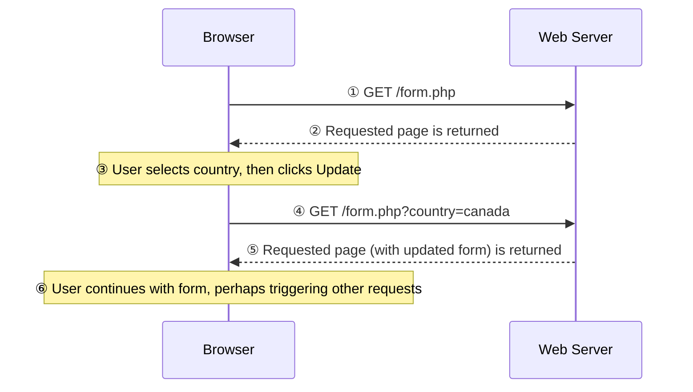
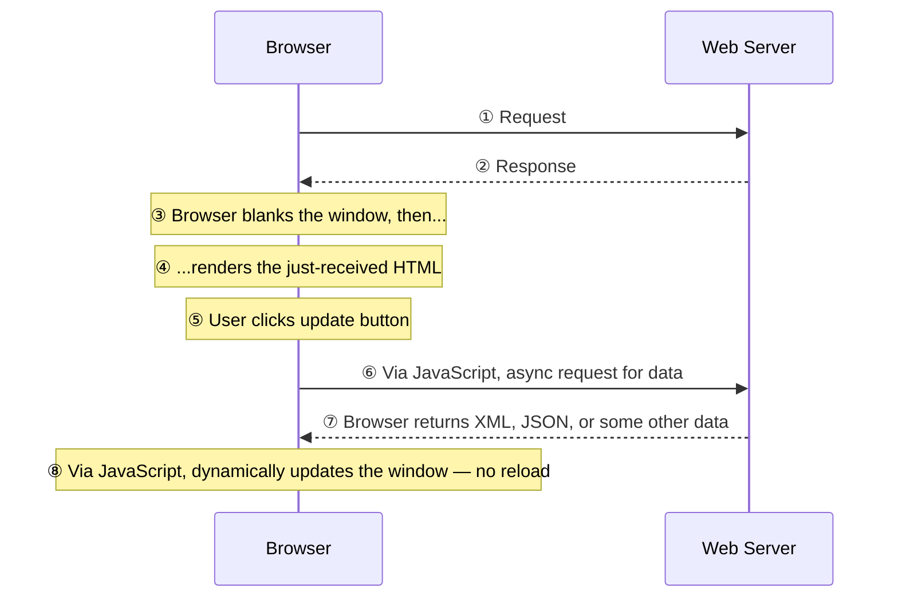

**JavaScript** was introduced by Netscape in 1996, an implementation of the standardized scripting language **ECMAScript** (latest: ECMAScript-262, 15th edition, June 2024). It became far more central to web development in the mid-2000s once it could interact with the [[Document Object Model]] and use **AJAX**.

**Without JavaScript**, every change to the page means a full HTTP round trip and a full page reload:

**AJAX** — Asynchronous JavaScript And XML — is both an acronym and a general term for making **asynchronous data requests** from the browser: the page fetches data in the background instead of reloading the whole document, which is what lets a page update without a full page load.

