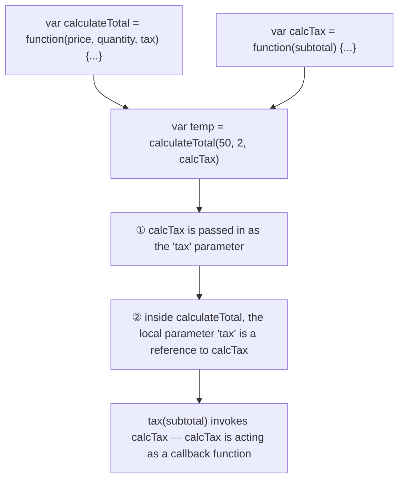
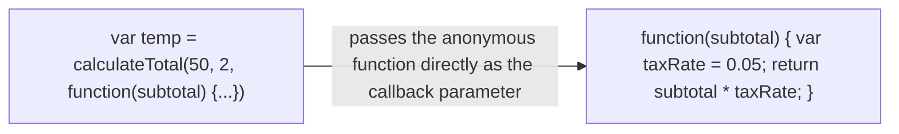

A **callback function** is a function passed into another function to be invoked later — often written **anonymously**, defined right at the call site instead of being named and declared separately. Common for responding to asynchronous work or events without cluttering the surrounding scope with a one-off named function.

The same thing works with an **anonymous function** defined inline instead of a separately-named one:

