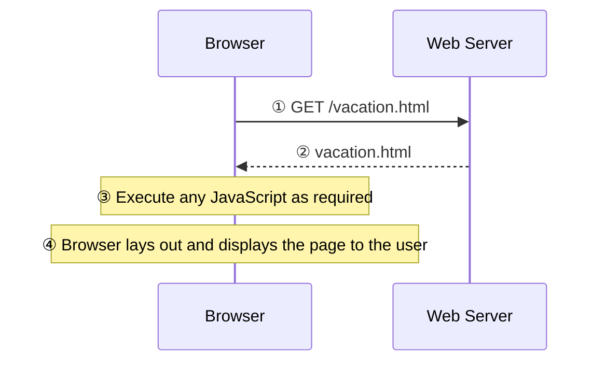

**Client-side scripting** lets the browser compute instead of the server — [[JavaScript]] runs right inside it, is dynamically typed, and is object-oriented in that almost everything is an object (prototype-based, not class-based like C++/Java — see [[Object Prototype]]).

**Advantages:** offloads processing to the client, so the browser responds to user events without a round trip · lets JS interact with the downloaded HTML in ways the server can't, closer to desktop software than plain HTML.

**Disadvantages:** mostly about how programmers use it — no guarantee a client has JavaScript enabled · browser/OS idiosyncrasies make cross-client testing hard · heavy JS apps can be complex to debug and maintain.

**Historical alternatives** (avoid): browser plug-ins like Flash, Silverlight, ActiveX, and Java applets (separate objects embedded via `<applet>`, written in Java rather than JavaScript despite the similar name) — both worked the same way, with the browser delegating the embedded object to a plug-in/runtime instead of executing it itself.

**Users without JavaScript still exist:** web crawlers, browser plug-ins that interfere with it, text-based browsers, and visually disabled clients using screen-reading software. See [[The noscript Tag]] for how to accommodate them.
