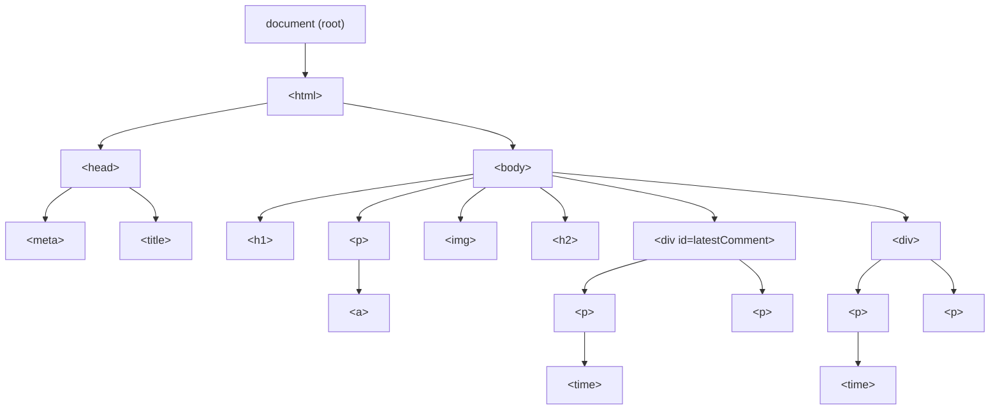
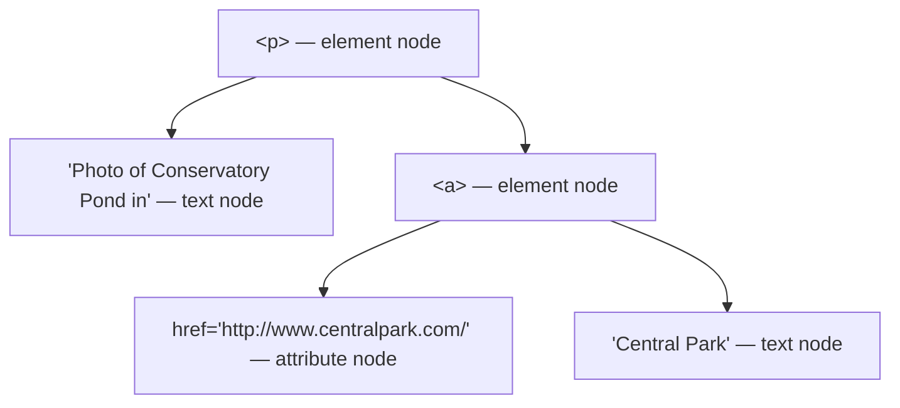
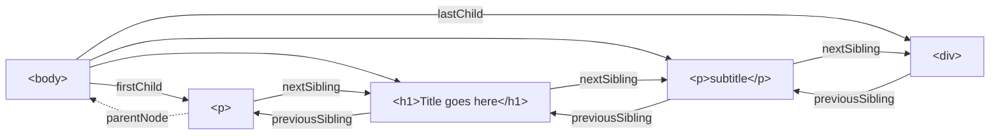
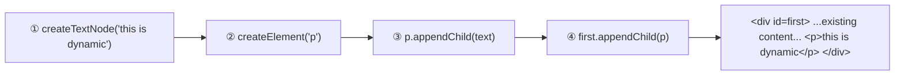

The **Document Object Model (DOM)** is the programming interface (API) JavaScript uses to interact with the HTML document it's embedded in. Per the W3C, it's a platform- and language-neutral interface letting programs dynamically access and update a document's content, structure, and style.

**Nodes** — every element in the document is a node: element nodes, text nodes, and attribute nodes, all sharing a common set of properties (`attributes`, `childNodes`, `firstChild`, `lastChild`, `nextSibling`, `nodeName`, `nodeType`, `nodeValue`, `parentNode`, `previousSibling`):

Navigating between nodes uses these relationship properties directly:

**The `document` object** is the root JS object for the whole page (e.g. `document.URL`, `document.inputEncoding`). Key methods: `createAttribute()`, `createElement()`, `createTextNode()`, `getElementById(id)`, `getElementsByTagName(name)`.

**Modern node access** — `querySelector()` / `querySelectorAll()` take a CSS selector, as specific as needed (`document.querySelector("div.user-panel input[name='login']")`); `querySelectorAll()` returns a *static* (not live) NodeList. `Element.querySelector()` scopes the search to within a given element.

**Element node properties:** `className`, `id`, `innerHTML` (everything inside the tags — the primary way to update a div from JS), `style`, `tagName`; plus tag-specific ones like `href` (`a`), `src` (`img`/`input`/`iframe`/`script`), `value` (`input`/`textarea`), `name` (form-related tags).

**Modifying an element** — `innerHTML` is fast but risks injecting unvalidated markup; for simple text, `innerText` is safer. The more rigorous (but verbose) route uses `createTextNode()`, `removeChild()`, and `appendChild()`:

Style/class changes go through the `style` or `className` property, or (HTML5) the `classList` API (`.add()`, `.remove()`, `.toggle()`) — `className` is usually the better choice since it keeps styling out of the code, where designers can reach it.
