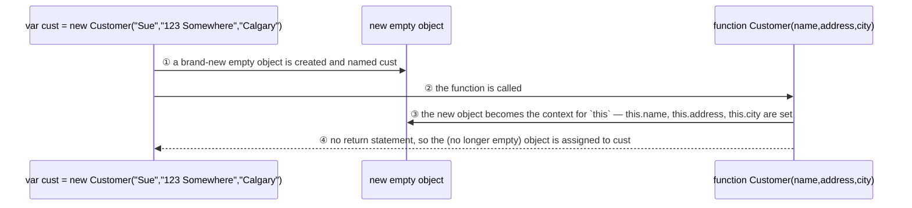

A regular function can double as a **constructor** when called with `new`: JavaScript creates a brand-new empty object, binds it as `this` inside the function body, and — since the function has no `return` statement — implicitly hands that (no longer empty) object back to the caller.

```js
function Customer(name, address, city) {
  this.name = name;
  this.address = address;
  this.city = city;
}
var cust = new Customer("Sue", "123 Somewhere", "Calgary");
```



> [!note] Coding convention
> Capitalize the first letter of a constructor function's name (`Customer`, not `customer`) to signal it's meant to be called with `new`.

This is the pattern [[Object Prototype|prototypes]] build on: a constructor function sets up each instance's own properties, while methods are better attached once to `.prototype` than redefined inside the constructor.
