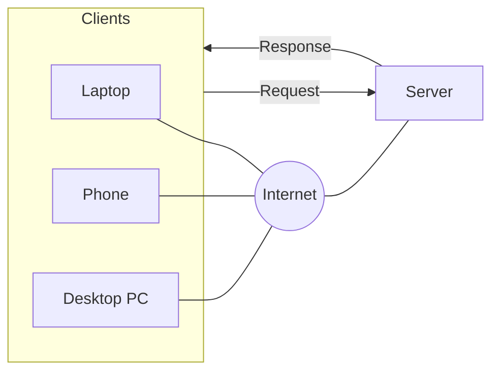

**HTTP** (HyperText Transfer Protocol) is the web's **application-layer** protocol. Its four defining traits: **client–server** model · **request–response** pattern · **stateless** (each request stands alone) · carried over [[Transmission Control Protocol|TCP]] streams.

*Clients reach the server across the Internet; requests go one way, responses come back (slide 3)*

**URL revisited** — general form `scheme:scheme-specific-part`; for HTTP that's `http://host:port/path?query`. The port defaults to **80** when omitted: `http://example.com/` → port 80, `http://example.com:8080/` → port 8080 (see [[Well-Known Ports]]).

**What happens on a request:**
1. The client resolves the host to an IP address via DNS (see [[Domain Name]])
2. It opens a TCP socket to port 80 (or the port given) on the server
3. It sends the request as **lines of text** — see [[HTTP Request]] and [[HTTP Response]]

Being stateless and having no built-in security are HTTP's two big limitations — fixed by [[Session Management]] and [[SSL and TLS]] respectively.

See also [[HTTP]] from ECE 4436A for the networking side.
