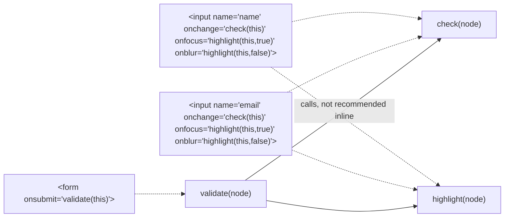

A **JavaScript event** is an action JavaScript can detect — often user-initiated — that can be "triggered" and then "handled" by a function that does something in response.

**Two ways to handle events:**

| Approach | Example | Notes |
|---|---|---|
| Event property | `myButton.onclick = function(){…};` | simpler, but one handler per property — assigning a new one clobbers the old |
| Event listener | `myButton.addEventListener('click', function(){…});` | preferred — chains multiple handlers instead of overwriting |

Mixing markup with behaviour (`
`) still works but is discouraged; setting properties or attaching listeners from a separate script keeps content and interaction apart. Using inline event-property hooks across a whole form quickly fans out into several small handler functions:

**The event object** — when triggered, the browser builds an event object passed as the handler's first parameter (e.g. `function(e) { let x = e.clientX; }`), with properties including `bubbles` (propagates up the DOM), `cancelable`, `target` (what dispatched it), and `type`.

**Event types by class:**

| Class | Examples |
|---|---|
| Mouse | `click`, `dblclick`, `mousedown`, `mouseup`, `mouseover`, `mouseout`, `mousemove` |
| Keyboard | `keydown` → `keypress` → `keyup` (that order) |
| Form | `blur`, `change`, `focus`, `reset`, `select`, `submit` |
| Frame | `abort`, `error`, `load` (most important — object finished loading), `resize`, `scroll`, `unload` |
| Touch | `touchstart`, `touchmove`, `touchend` — limited browser support historically, analogous to mouse events |

`window.onload` is the standard place to put all JavaScript initialization, since code that touches an element before it has loaded will error.
