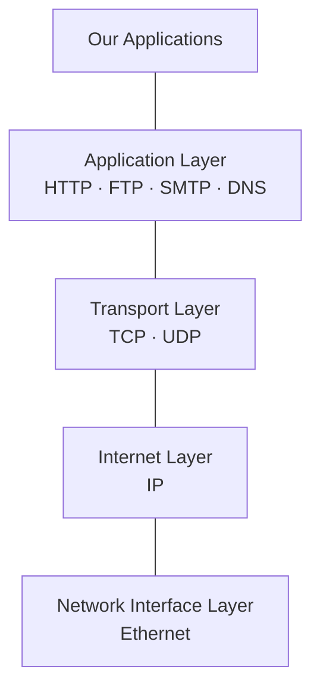

The Internet is built as a **stack of layers**, each using the one below it. Our web applications sit on top of the **application layer**, which is where [[HyperText Transfer Protocol|HTTP]] lives.

*The layer stack, with example protocols at each level (slide 4)*

| Layer | Example protocols | Covered in |
|---|---|---|
| Application | HTTP, FTP, SMTP, DNS | [[HyperText Transfer Protocol]] · [[Well-Known Ports]] |
| Transport | TCP, UDP | [[Transmission Control Protocol]] |
| Internet | IP | [[Internet Protocol]] |
| Network interface | Ethernet | — |

See also [[Protocol Layering]] from ECE 4436A.
