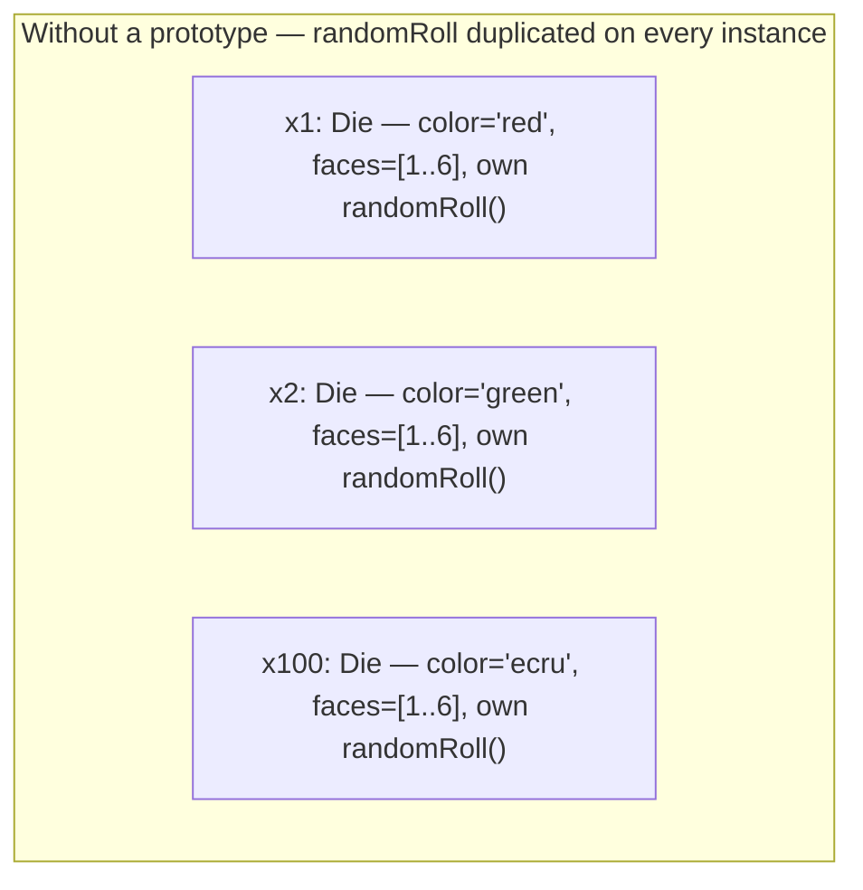
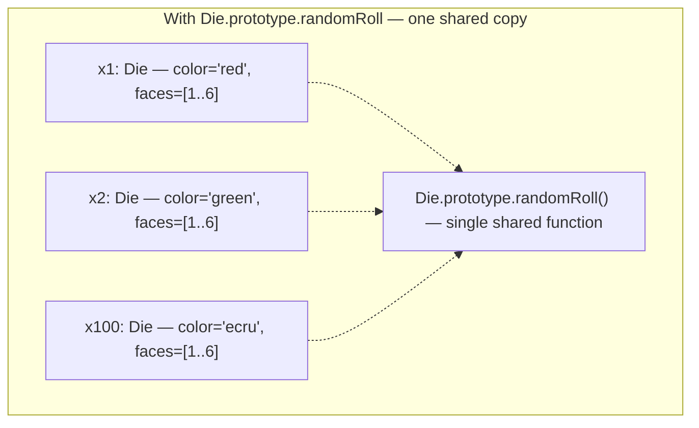

A **prototype** is JavaScript's mechanism for sharing behaviour across objects without classes — it's what makes JS behave more like an object-oriented language despite being **prototype-based** rather than class-based (C++, Java). Where a class defines all of an instance's properties up front and can't add properties dynamically at run time, a prototype-based object can add or remove properties dynamically, and a whole hierarchy is built by assigning an object as another's prototype rather than subclassing.

**Why prototypes matter** — defining a method inside a constructor function duplicates that method on every instance:

```js
function Die(color) {
  this.color = color;
  this.faces = [1,2,3,4,5,6];
  this.randomRoll = function () {…};   // duplicated per instance
}
```



Attaching it to the constructor's `.prototype` instead shares one copy across every instance:

```js
function Die(color) {
  this.color = color;
  this.faces = [1,2,3,4,5,6];
}
Die.prototype.randomRoll = function () {…};
```



Existing built-in types can be extended the same way, e.g. adding a `countChars()` method to every string via `String.prototype.countChars = function (c) {…}`. `Object.create(parentObj)` creates a new object whose prototype is `parentObj`, for building a prototype chain directly.
