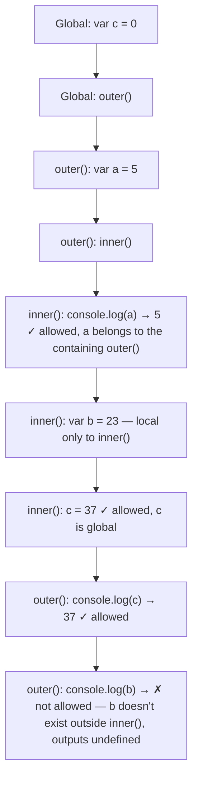
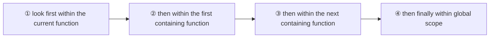

**Scope** governs where a declared variable or function is visible. In JavaScript, scope is determined **at design-time** (lexically, by how functions are nested in the source) rather than at runtime.

A variable declared inside a function is visible anywhere within that function (including nested functions inside it), but not from outside it. A variable declared outside any function is **global** and visible everywhere:

When a name is used, JavaScript resolves it by walking outward through the scope chain:

> [!tip] Remember
> Scope is determined at **design-time** — i.e. by where a variable is written in the source, not by which function happens to call which at runtime.

See also [[Variable Hoisting]] for how declarations (but not assignments) get moved to the top of their scope before this lookup even happens.
