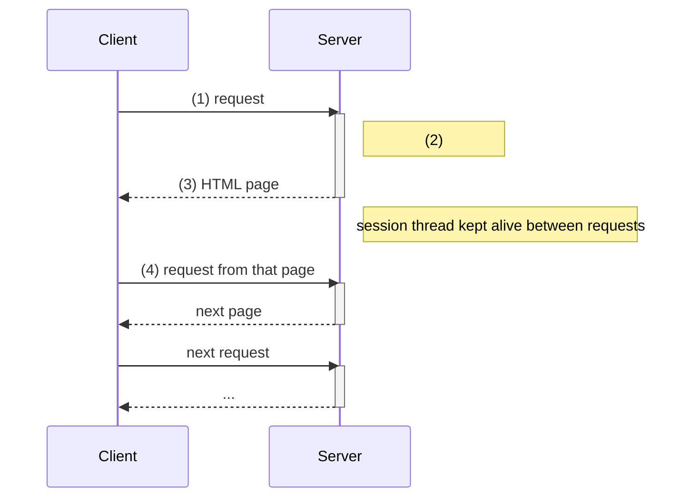

**Session management** is how a server ties a series of requests to the same client, working around the fact that [[HyperText Transfer Protocol|HTTP]] is **stateless** and has no built-in way to track clients (e.g. whether a user is logged in).

*A session thread on the server spans several request–response pairs (slide 39)*

> [!warning] Numbers unlabelled on the slide
> Slide 39 only numbers the steps (1)–(4) without saying what each is. Read as: (1) first request · (2) server handles it and starts the session · (3) page sent back · (4) the next request is recognised as part of the same session.

**Techniques:** URL rewriting · hidden form fields · [[HTTP Cookies|cookies]] · SSL sessions.

See also [[Session]] from ECE 4436A.
