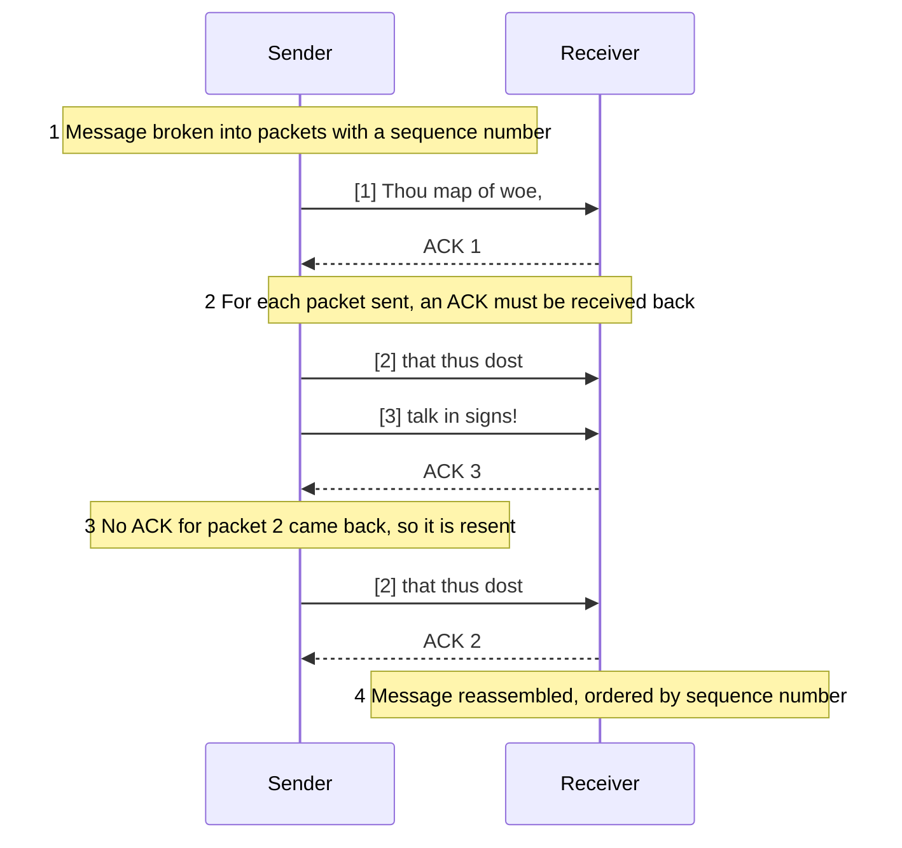

**TCP** (Transmission Control Protocol) is a layer on top of [[Internet Protocol|IP]] that turns unreliable datagrams into a **reliable, ordered stream** of data.

- **Reliability** — lost datagrams are retransmitted, out-of-order ones reordered
- **Connection-oriented** — establish a connection between client and server · stream data in **both directions** · close the connection
- **Socket** — one end point of a connection, identified by an **(IP address, port number)** pair (see [[Well-Known Ports]])

*How TCP gets a message across: sequence numbers, ACKs, and resending (slide 10)*

> [!note] What went wrong with packet 2
> The slide only shows that **ACK 2 never arrives** — it doesn't say whether packet 2 or its ACK was the one lost. Either way the sender's response is the same: resend.

See also [[TCP]] from ECE 4436A.
