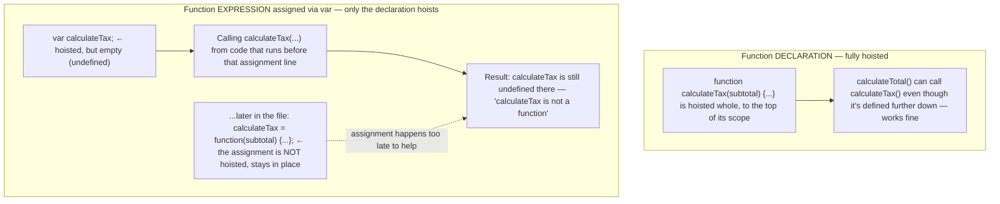

A variable declared anywhere in a function's body is conceptually moved ("hoisted") to the top of the function — but only the **declaration** is hoisted, not the initialization:

```js
function sum(a, b) {
  console.log(myString);      // => undefined (declaration hoisted, not the value)
  var myString = 'Hello World';
  console.log(myString);      // => 'Hello World'
  return a + b;
}
```

**Function declarations are hoisted whole** (the entire function, not just its name), so it can be called from code that appears above its definition. **But** a function *expression* assigned to a `var` only has the `var` declaration hoisted — the assignment stays exactly where it is, so calling it too early fails:


