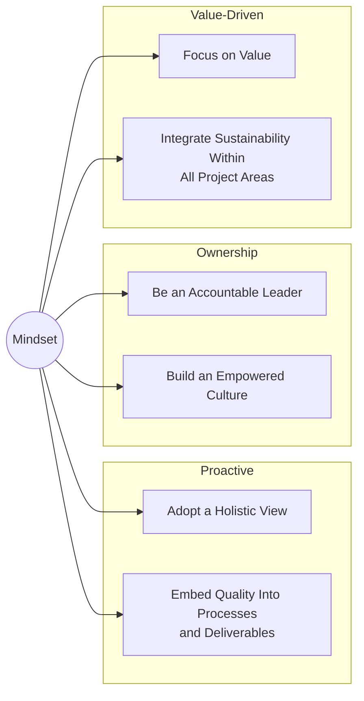

The **project management mindset** is PMI's set of principles for **proactive ownership** — how a project manager should think, as distinct from which processes they run.

The six principles fall into three groups: **Proactive**, **Ownership** and **Value-Driven**.

*The mindset and its three principle groups (Lecture 6, slide 2)*

| Principle | Group | What it asks of you |
|---|---|---|
| **Adopt a holistic view** | Proactive | See the whole life cycle: seamless integration, risk management and stakeholder engagement rather than isolated phases |
| **Be an accountable leader** | Ownership | Own the outcome, not just the assigned tasks |
| **Embed quality into processes and deliverables** | Proactive | Build quality in rather than inspecting it at the end; meet acceptance criteria and stakeholder satisfaction |
| **Build an empowered culture** | Ownership | Give the team the authority to act |
| **Focus on value** | Value-Driven | Judge the work by the benefit delivered, not the activity completed |
| **Integrate sustainability within all project areas** | Value-Driven | Treat environmental, social and economic impact as joint accountability across every area and phase — see [[Sustainability Pyramid]] |

*Source: PMBOK® Guide — Eighth Edition and The Standard for Project Management*
