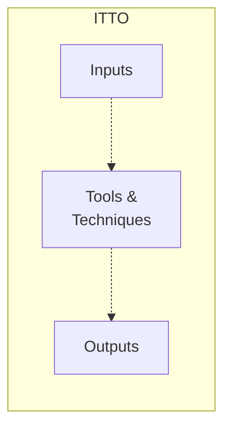

A **project management process** is a formalized, logically connected series of activities designed to manage a [[Project]] throughout its life cycle.

Each process has a specific **function** and a key **output**, achieved by applying tools and techniques to various inputs. This pattern is called **ITTO** — Inputs · Tools & Techniques · Outputs.

*ITTO: tools and techniques turn inputs into outputs (Lecture 6, slide 4)*

PMI defines **49 processes**, organized along two axes:
- [[Process Groups]] — the *when* (chronological phases)
- [[Knowledge Areas]] — the *what* (fields of specialization)

Every process sits at the intersection of one of each — see the full grid in [[PMBOK Process Matrix]].
