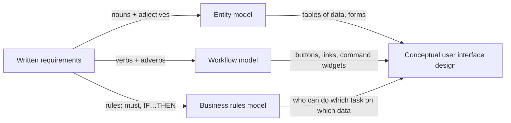
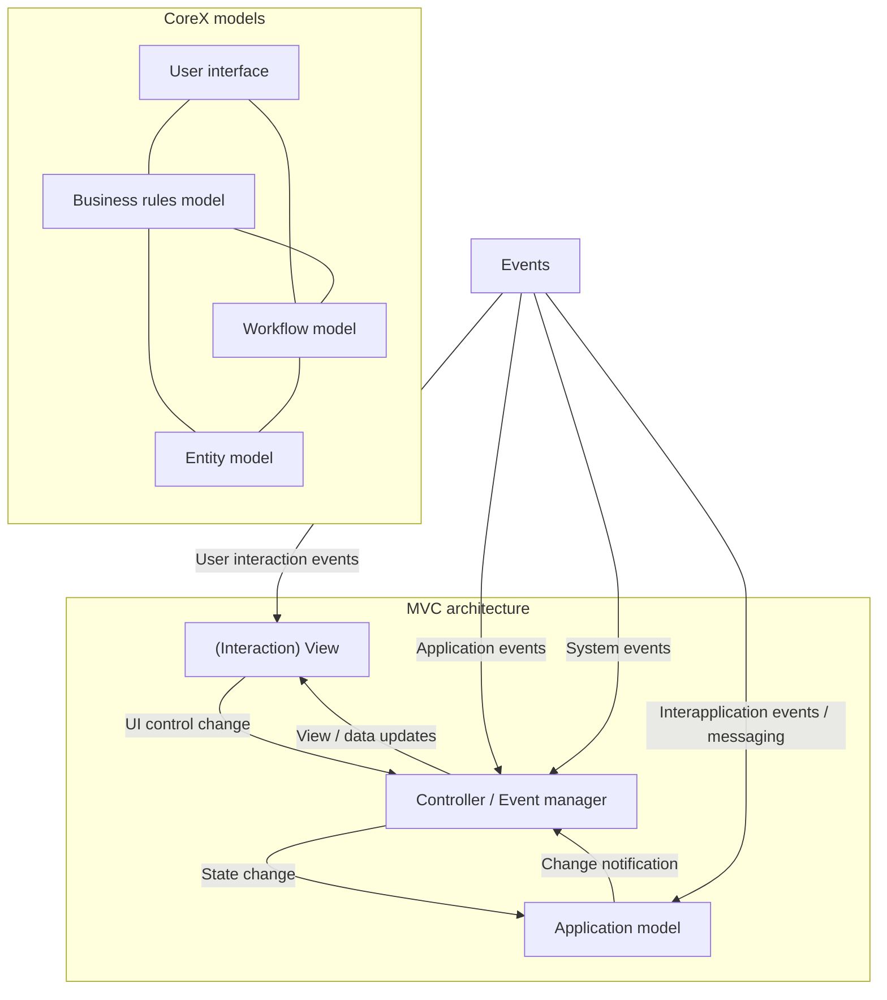
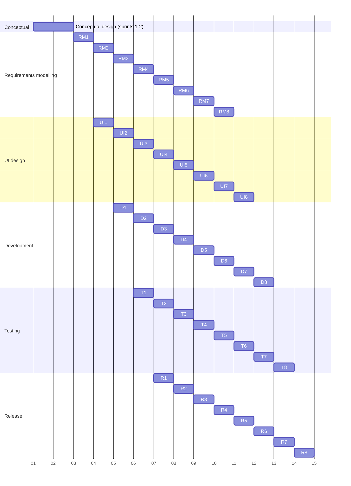

**CoreX** (Craig Errey) is a process and "blueprint" for designing software applications that comes from the **organizational psychology** point of view. It replaces ambiguous written requirements with a small set of visual models that, together, give enough understanding of the system to feed an agile, iterative process.

## The five models

| Model | Gives an overview of… |
|---|---|
| [[Domain Model]] | the domain as it relates to the solution being created |
| [[Workflow Model]] | the actions to be done on / through the system |
| [[Data Model]] (CoreX: *entity model*) | the data structures needed in the system |
| [[Business Rules Model]] | the business constraints that need to apply |
| [[Conceptual User Interface Design]] | how the system would look if developed from the previous models |

All of them are built with [[Progressive Decomposition]]. The first four are UI-independent; only the conceptual UI reflects the target platform (GUI, touch, speech, IVR).

## The three-step process (reading)

1. **Requirements gathering** — understand people, work and performance to *define the problem*. Main technique: **job analysis and design (JAD)**, which yields [[Work Requirements]].
2. **Visual requirements modelling** — define the *solution* through the app's design and behaviour (the five models).
3. **User interface design** — design the full UI to complete the blueprint.

*CoreX process overview (reading, §3)*

```mermaid
flowchart LR
    subgraph rg["Requirements gathering — define the problem"]
        direction TB
        mkt["Market, customers,<br>brand and experience"]
        prod["Products and services"]
        ppl["People, capabilities"]
        jt(("·"))
        si["Strategic intent, vision,<br>values, culture and KPIs"]
        hpm["High performance model"]
        jb(("·"))
        tech["Technology and applications"]
        pol["Policies, processes,<br>and procedures"]
        work["Work and activities"]
        mkt --- jt
        prod --- jt
        ppl --- jt
        jt --> si
        jt --> hpm
        si --> hpm
        tech --- jb
        pol --- jb
        work --- jb
        jb --> si
        jb --> hpm
    end
    subgraph vm["Visual requirements modelling — define the solution"]
        direction LR
        dm["Domain model"]
        wf["Workflow model"]
        br["Business rules model"]
        en["Entity model"]
        cui["Conceptual user<br>interface design"]
        dm --> wf
        dm --> br
        dm --> en
        wf <--> br
        br <--> en
        wf --> cui
        br --> cui
        en --> cui
    end
    subgraph ux["User interface design — complete the blueprint"]
        direction TB
        ia["Information architecture"]
        uif["User interface flow diagram"]
        dfw["Design framework, system,<br>standards and patterns"]
        uid["User interface design"]
        bvd["Brand and visual design"]
        uis["User interface specifications"]
        ia --> uif
        ia --> dfw
        uif --> uid
        dfw --> uid
        bvd --> dfw
        bvd --> uis
        uid --> uis
    end
    rg --> dm
    cui --> ux
```

> [!warning] Check against the reading
> The empty circles stand in for the shared bus lines in the original: the three top boxes and the three bottom boxes each feed *both* "Strategic intent…" and "High performance model".

## NAVAs — the building blocks

Models are built by extracting four word types from the written requirements, using a controlled vocabulary (see [[Requirements Glossary]]):

| Element | Meaning | Lands in | Shown in a GUI as | In code |
|---|---|---|---|---|
| **Nouns** | data, people, things | entity/[[Data Model]] | tables, single-record forms | database |
| **Adjectives** | attributes that tell instances apart | entity/data model | fields/columns | database |
| **Verbs** | actions on a noun | [[Workflow Model]] | buttons, links, commands | functionality |
| **Adverbs** | how / when / to what extent a verb is done | workflow model | options on commands | functionality |

The [[Business Rules Model]] acts like grammar: which verbs can operate on which nouns, by whom.

*How NAVAs flow from written requirements into the models and the UI (reading, §7)*

## Key principles (reading)

1. **Define the problem before designing the solution** — the app is a means to solve a work-performance problem, inside a wider change program.
2. **Human-centred design ≠ giving people what they say they want** — JAD gives an agreed statement of what people *should* be doing.
3. **Start with the future state**, not the current state, to avoid legacy thinking.
4. **Convert non-functional requirements into functional ones** — KPIs, best-practice workflow, and UX become things the team is held accountable for (see [[Non-Functional Requirement]]).

## Key techniques (reading)

1. [[Progressive Decomposition]] with numerical constraints.
2. **Near-total separation of concerns** — each model does one thing; nearly all rules live in the business rules model, so entity and workflow models stay unconstrained.
3. **Co-design with preparation** — the analyst drafts models to ~Level 2 *before* a [[Facilitated Workshop]], then facilitates the group building them from scratch (domain → workflow → entity → UI), using the drafts only to restart a stalled session or compare.
4. **Two phases: conceptual, then detailed** — all five models to ~Level 2 first (4–8 weeks even for large apps), usability-test it, *then* decide buy vs. build and go deeper.

## Mapping to MVC (reading)

*CoreX models vs. Model–View–Controller (reading, §7)*

- **Model** ≈ entity model · **Controller** ≈ workflow model + business rules model · **View** ≈ user interface.

## Combining Agile and Waterfall (reading)

Do the conceptual design for the whole app in sprints 1–2, then split the app into self-contained areas (e.g. by job KRA) and pipeline each through detailed modelling → UI → dev → test → release.

*Staggered delivery after the conceptual design — axis numbers are months M1–M14 (reading, §10.3)*

> [!question] Who is it for?
> The reading admits CoreX won't appeal to Agile purists who believe you can't know requirements until you build something — it's pitched at BAs, business architects and UI designers who want precise, visual documentation everyone can sign off on.
