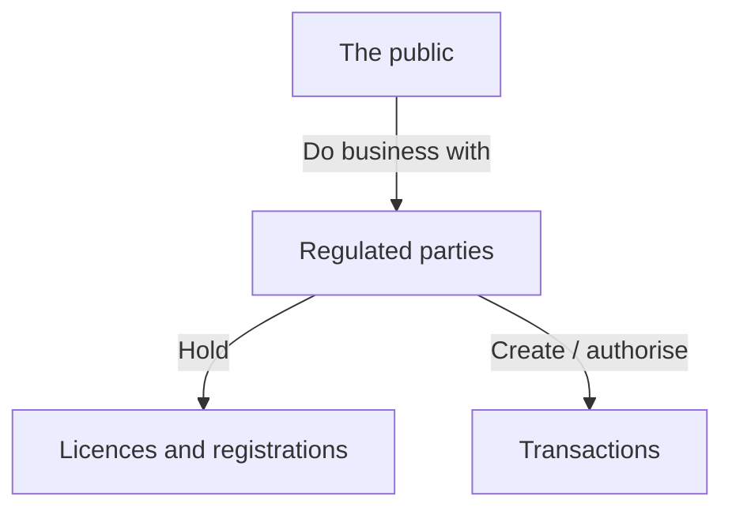
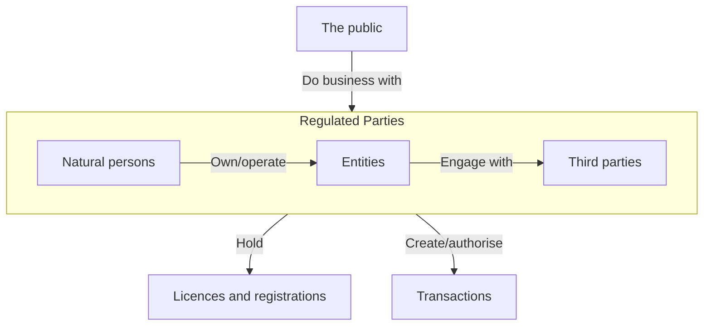

The **data model** (CoreX: *entity model*) models the **structure** of the system. It's equivalent to a **logical data model**: it represents the **nouns** and their basic relationships with each other, with the **adjectives** as attributes (properties or states).

- A **simplified class diagram / ER diagram** is sufficient — just the class/entity names (with attributes if possible).
- A basic description of each relationship is enough at this level; details come later.
- Built with [[Progressive Decomposition]].
- **Groups:** at Level 2 and deeper, a group (a box drawn around entities) shows how a set of entities relates to the parent entity.

## Example — government regulator

*Level 1 (slide 39)*

> [!warning] A box isn't necessarily a table
> At this level a box won't necessarily become an entity or a class at the technical level — it may become a **package** or a **component**.

*Level 2 — "Regulated parties" decomposed into a group (slide 40)*

## CoreX rules for the entity model (reading)

- Relationships are limited to **association, composition, containment, and inheritance**.
- **All entities are plural and all relationships are many-to-many** — cardinality and other constraints go in the [[Business Rules Model]]. This keeps the model simple and the eventual database flexible.
- Entities can be added at lower levels and related to others even if they don't sit inside a parent.
- Decomposed until it turns into a classic ER diagram (see [[Enhanced Entity-Relationship Model]] from SE 3309A).
