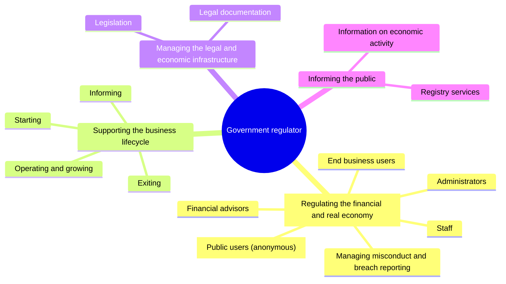

The **domain model** is a conceptual model that summarizes what was collected during [[Requirements Elicitation]] — the key concepts, processes, functional areas, activities and decisions of the work and its context. It's the first of the five [[CoreX]] models, and the place where **scope** gets drawn.

- **Mind maps** are the popular tool for it (any conceptual relationship diagram works; make as many as the domain needs).
- Built with [[Progressive Decomposition]].
- Why it matters for usability: when the app reuses the domain's own concepts — in navigation labels, workflows, the data shown — people recognize them and their job knowledge kicks in.

## Example — government agency

*Level 1 is the four branches off the centre; Level 2 adds the outer nodes (slides 20–25)*

- **Level 3+** (slide 26): the same map expanded until each branch has dozens of leaf nodes — too dense to reproduce, but it shows how far decomposition goes.
- **Scoping the app** (slide 27): on the full map, the region the app will cover is shaded; everything outside it is out of scope. This is how the domain model answers the "what is the scope?" question.

## A system-structure tree works too

*Hierarchical system structure used as a domain model (slide 28)*

```mermaid
flowchart TD
    root["Party Construction Based on Big Data"]
    a["Public opinion and working style of the party"]
    b["Live Class"]
    c["Party's Activities about Working Style"]
    d["Personal Center"]
    root --> a & b & c & d
    a --> a1["Analysis of Hot News through Big Data"]
    a --> a2["Analysis and Matching of Party"]
    a --> a3["Matching the Central File"]
    a --> a4["Display of the Relevant"]
    b --> b1["Learning Reservation"]
    b --> b2["Online Interactive Question and Answer"]
    b --> b3["Graduation Certificate"]
    b --> b4["Courseware Reading"]
    c --> c1["Display of Activities in Various Places"]
    c --> c2["Launching of Activities"]
    c --> c3["Film and Television Information of Activities"]
    c --> c4["Evaluation Interaction"]
    d --> d1["Data Evaluation for Learning Score"]
    d --> d2["Learning process"]
    d --> d3["Post comments"]
```

