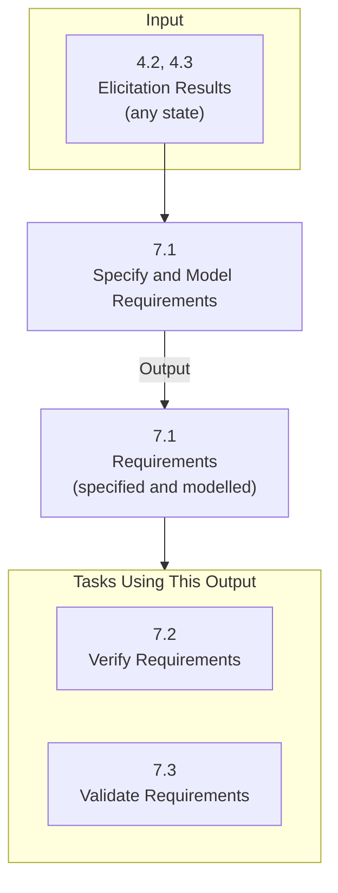

**Requirements analysis** (BABOK: *Specify and Model Requirements*) is the practice of analyzing elicitation results and creating representations — specifications and models — of those results. It's the step after [[Requirements Elicitation]] in the [[SDLC]].

*BABOK task 7.1 — inputs, output, and the tasks that use the output (slides 4–7)*

- **Verify** → make sure the requirements meet the **stakeholders' needs**
- **Validate** → make sure the requirements satisfy the **business goals**

> [!tip] Build traceability in as you go
> Include the [[Requirements Traceability|traceability]] information *while* creating the models/artifacts, not afterwards.
