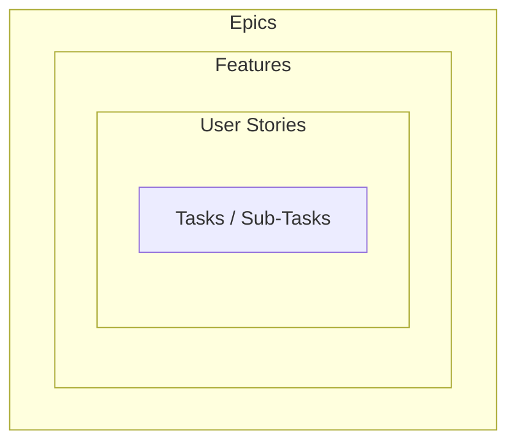

**Work items** are the units of work tracked in an Agile project. They nest from largest to smallest: [[Epic]] → [[Feature]] → [[User Story]] → **Tasks/Sub-tasks**.

*Each level contains the ones inside it (slide 2)*

| Level | What it is | Online-store example |
|---|---|---|
| [[Epic]] | a large body of work, broken down into smaller stories | Online-Store |
| [[Feature]] | an actionable aspect of an epic, holding several stories (optional level) | Shopping Cart |
| [[User Story]] | a feature or requirement from the user's perspective | As a shopper I would like to be able to delete an item from my shopping cart |
| Tasks / sub-tasks | individually manageable pieces of work, most likely technical | — |

> [!note] Scope of this course
> Tasks/sub-tasks are outside the scope of SE 3352 — the course stops at user stories.
