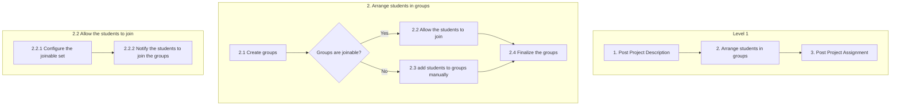

The **workflow model** models the **behaviour** of the system: it shows the execution flow of the key tasks people perform. In [[CoreX]] it's "the backbone of the application" — a diagram of the KRAs, key tasks and decisions in people's jobs (see [[Work Requirements]]).

- A **simplified UML activity diagram** is enough.
- **Activities** represent key tasks of the system.
- **Decisions** can branch to multiple options, not just yes/no.
- Built with [[Progressive Decomposition]]: Level 1 ≈ 3–8 key tasks and 1–2 decisions; deeper levels ≈ 10–15 tasks and 3–5 decisions.

## Symbols

| Symbol | Use |
|---|---|
| Start (filled circle) | where the flow begins |
| Connector (arrow) | order of execution |
| Decision (diamond) | branch on a user decision or a business-rule test |
| Activity (rounded box) | a key task — a verb + noun, e.g. "Create groups" |
| End (ringed circle) | where the flow ends |
| Join / Fork (thick bar) | parallel flows — **not likely to be needed at this level** |

> [!note] Kept deliberately simple
> CoreX leaves constraints, roles and permissions, and swim lanes *out* of the workflow model — those live in the [[Business Rules Model]]. That's what keeps workflows easy to create and read.

## Example — arranging student project groups

*Three levels of the same workflow; each panel decomposes one task from the panel to its left (slide 34)*

Slide 33 shows a much larger real-world workflow: a Level 1 column of colour-coded tasks, each expanded into its own coloured region of sub-flows — the same decomposition idea at scale.

## Down to system tasks (reading)

At the deepest levels, key tasks become **system tasks** that map to blocks of code acting on entities:
- **Domain tasks** — specific to the work domain (e.g. a video-processing effect)
- **Application tasks** — generic operations (delete, copy, paste)
- **Interaction tasks** — happen in the UI (drag and drop)

CoreX uses a controlled set of about seventy application and interaction tasks, which it claims covers virtually any enterprise app.
