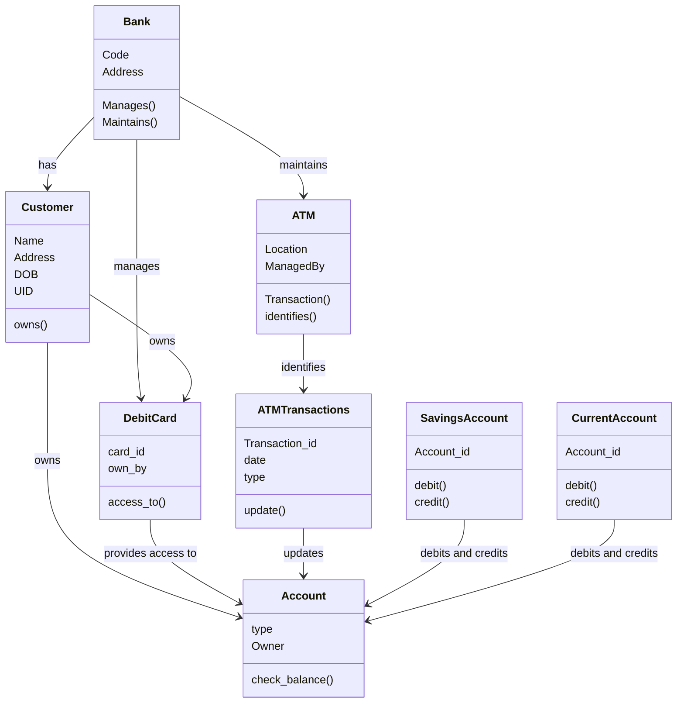
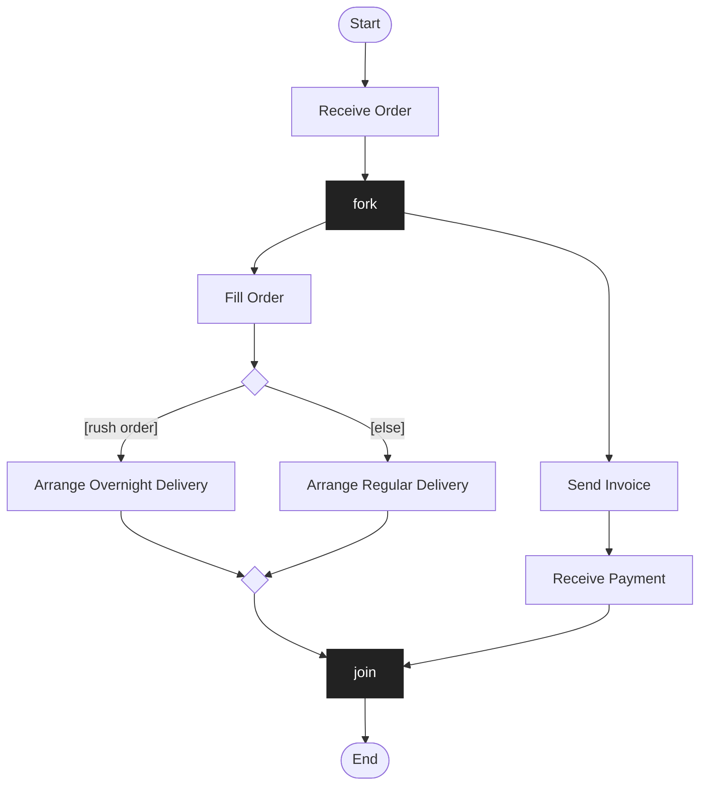

# Analytical Skills

> [!info]- Slide index — where each section comes from
> | Section of this note | Slides in the deck |
> |---|---|
> | *Title slide* | 1 *part divider* |
> | *Intro / review* | 2 The objective of SE · 3 Software Development Life Cycle (SDLC) |
> | **Analytical "Thinking" Skills** | |
> | ⤷ `Analytical Skill` | 4 Analytical "Thinking" Skills · 5 Analytical "Thinking" Skills · 6 Analytical "Thinking" Skills |
> | ⤷ `Critical Thinking Categories` | 7 Critical Thinking Categories |
> | **Recognizing & Organizing Concepts (exercises)** | 8 *part divider* |
> | ⤷ Spot and organize | 9 How many candles… · 10 Organize the concepts… in a 3-level hierarchy |
> | ⤷ LinkedIn | 11 Organize the concepts related to LinkedIn · 12 Describe LinkedIn in terms of Epics, Features, User-stories |
> | ⤷ ATM class diagram → simplified ER | 13 *(class diagram exercise)* 📊 |
> | ⤷ Process Order activity diagram | 14 Pick one of the activities… 📊 |

## Intro / Review

The objective of SE and the SDLC were covered in Lecture 01 — see [[Objective of Software Engineering]] and [[SDLC]].

## Analytical "Thinking" Skills

![[Analytical Skill]]

![[Critical Thinking Categories]]

## Recognizing & Organizing Concepts (exercises)

These are practice prompts for the skills behind the [[CoreX]] models — the answers aren't in the deck.

### Spot and organize (slides 9–10)
- A detailed hidden-object picture of a room (fireplace, piano, bookshelves…): first count the candles, then organize everything you see into a **3-level hierarchy**. Same move as building a [[Domain Model]].

### LinkedIn (slides 11–12)
- Organize the concepts related to LinkedIn in a 3-level hierarchy.
- Describe LinkedIn in terms of [[Epic|epics]], [[Feature|features]] and [[User Story|user stories]].

### Class diagram → simplified ER model (slide 13)

*Detailed ATM class diagram — organize it into 3 levels using a simplified [[Data Model]] (slide 13)*

> [!warning] Check against the slide
> The arrows from Savings/Current Account up to Account are drawn with a small arrowhead and the label "debits and credits", so they're shown here as associations. They may well be meant as **inheritance** (both are kinds of Account) — which is also the natural way to group them into one level.

### Activity diagram — find three ways to do one activity (slide 14)

*Process Order activity diagram (slide 14)*

Task: pick one activity (e.g. *Fill Order*) and come up with **three different ways** it could be broken into sub-steps — the same kind of decomposition as the levels in the [[Workflow Model]].

## Notes to Self
- Work through the LinkedIn hierarchy and epics/features/stories.
- Try the 3-level ER grouping of the ATM diagram and three decompositions of one Process Order activity.
